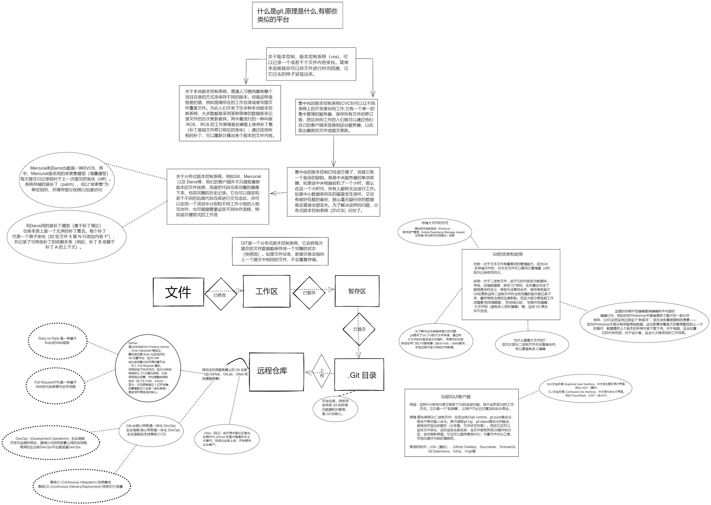

# Git 入门教程：从零开始掌握版本控制

> 在软件开发中，Git 已经成为版本控制的标配工具。无论你是刚入门的新手，还是有一定经验的开发者，掌握 Git 都是必不可少的技能。本文将从零开始，带你快速上手 Git 的基础操作和实用技巧。

## 📌 目录

- [一、Git 的四个应用工具](#一git-的四个应用工具)
- [二、基础命令详解](#二基础命令详解)
- [三、首次上传项目到 GitHub](#三首次上传项目到-github)
- [四、分支管理技巧](#四分支管理技巧)
- [五、版本控制工具对比](#五版本控制工具对比)
- [六、常见问题 FAQ](#六常见问题-faq)
- [七、进阶技巧](#七进阶技巧)

---

## 一、Git 的四个经典应用

Git for Windows 提供了多种使用方式，根据你的习惯选择合适的工具：

### 1. Git Bash

**特点**：模拟 Linux/Unix 下的 Bash shell 环境

**适用场景**：

- 喜欢使用 Linux 命令的开发者
- 需要使用 `ls`、`ssh` 等 Unix 命令
- 想要完整的 Git 体验

**示例**：

```bash
# Git Bash 中可以同时使用 Git 命令和 Linux 命令
git status
ls -la                # Linux 命令：列出文件
cd /path/to/project    # Linux 路径格式
```

---

### 2. Git CMD

**特点**：在 Windows 命令提示符（cmd.exe）中使用 Git

**适用场景**：

- 习惯 Windows 命令行的用户
- 不想切换到 Linux 风格
- 需要 Git 和 Windows 命令混合使用

**示例**：

```bash
# Windows CMD 中使用 Git
git status
dir                   # Windows 命令：列出文件
cd C:\path\to\project # Windows 路径格式
```

**注意**：Git for Windows 安装时会自动将 git 命令添加到系统 PATH，所以可以直接在 cmd 中使用。

---

### 3. Git GUI

**特点**：Git 官方自带的图形界面，基于 Tcl/Tk 开发

**适用场景**：

- 不熟悉命令行的用户
- 需要可视化操作
- 想要直观地查看分支和提交历史

**功能**：

- 查看文件修改
- 暂存和提交文件
- 创建和合并分支
- 查看提交历史

---

### 4. Git Release Notes

**说明**：这不是可执行程序，而是官方文档

**作用**：

- Git 官方每次发布新版本时（如 v2.40.0、v2.41.0）发布的说明文件
- 记录新功能、性能改进、兼容性变化、Bug 修复
- 了解最新特性和重要变更

**查看方法**：

```bash
# 查看当前 Git 版本的更新说明
git help releases
```

---

### 💎 本节小结

本节我们学习了 Git 的四种应用方式：

- **Git Bash**：Linux 风格命令行（推荐）
- **Git CMD**：Windows 命令行
- **Git GUI**：图形化界面
- **Release Notes**：版本说明文档

**建议**：日常开发推荐使用 Git Bash，功能最完整且跨平台兼容。

---

## 二、基础命令详解

### Git 基础命令

#### 1. 查看 Git 版本

```bash
git --version
```

**输出示例**：

```bash
git version 2.40.0.windows.1
```

**用途**：确认 Git 是否正确安装，以及当前版本。

---

#### 2. 查看 Git Bash 当前使用的文本编辑器

```bash
git config --global core.editor
```

**输出示例**：

```bash
nano
# 或者
vim
```

**用途**：查看 Git 配置的默认编辑器（用于编辑提交信息等）。

**修改编辑器**：

```bash
git config --global core.editor "code --wait"  # 设置为 VS Code
git config --global core.editor notepad      # 设置为记事本
```

---

#### 3. 查看 Git 的安装位置

```bash
where git
```

**输出示例**（Windows）：

```bash
C:\Program Files\Git\cmd\git.exe
C:\Program Files\Git\mingw64\bin\git.exe
```

**输出示例**（Linux/Mac）：

```bash
/usr/bin/git
```

**用途**：查找 Git 可执行文件的路径，方便调试。

---

#### 4. 查看 Git 的全局配置文件

```bash
git config --global --edit
```

**作用**：打开全局配置文件（通常是 `~/.gitconfig`），可以手动编辑配置。

**常用配置项**：

```ini
[user]
    name = Your Name
    email = your.email@example.com

[core]
    editor = code --wait
    autocrlf = true

[init]
    defaultBranch = main
```

---

## 三、首次上传项目到 GitHub

### 步骤 1：进入你的项目路径

```bash
cd "你的项目路径"
```

**示例**（Windows）：

```bash
cd "D:\MyProject"
```

**示例**（Linux/Mac）：

```bash
cd ~/projects/myproject
```

---

### 步骤 2：初始化本地 Git 仓库

```bash
git init
```

**输出示例**：

```bash
Initialized empty Git repository in D:/MyProject/.git/
```

**作用**：在当前目录下创建 `.git` 隐藏文件夹，初始化为 Git 仓库。

---

### 步骤 3：添加所有文件到暂存区

```bash
git add .
```

**作用**：将当前目录下所有文件的修改添加到暂存区（准备提交）。

**其他选项**：

```bash
git add file.txt                    # 只添加单个文件
git add src/                       # 只添加 src 目录
git add -A                         # 添加所有文件（包括删除的）
git add -u                         # 只添加已追踪的文件
```

---

### 步骤 4：提交到本地仓库

```bash
git commit -m "初次提交"
```

**输出示例**：

```bash
[master (root-commit) a1b2c3d] 初次提交
 1 file changed, 1 insertion(+)
 create mode 100644 README.md
```

**作用**：将暂存区的内容提交到本地 Git 仓库。

**提交信息规范**：

```bash
git commit -m "feat: 添加用户登录功能"
git commit -m "fix: 修复页面显示bug"
git commit -m "docs: 更新README文档"
git commit -m "style: 优化代码格式"
```

---

### 步骤 5：关联远程 GitHub 仓库

```bash
git remote add origin https://github.com/你的用户名/仓库名.git
```

**作用**：将本地仓库与远程 GitHub 仓库关联。

**说明**：

- `origin`：远程仓库的默认名称（可以自定义）
- 后面的 URL：从 GitHub 仓库页面复制（Clone with HTTPS）

**查看远程仓库**：

```bash
git remote -v
```

---

### 步骤 6：推送代码到 GitHub

**首先确认当前分支名**：

```bash
git branch
```

**输出示例**（可能显示）：

```bash
* master     # 带 * 的是当前分支
```

**根据分支名选择命令**：

**如果显示 `* master`**：

```bash
git push -u origin master
```

**如果显示 `* main`**：

```bash
git push -u origin main
```

**输出示例**：

```bash
Enumerating objects: 5, done.
Counting objects: 100% (5/5), done.
Writing objects: 100% (5/5), 1.2 KiB | 1.2 MiB/s, done.
Total 5 (delta 0), reused 0 (delta 0)
To https://github.com/username/repo.git
 * [new branch]      master -> master
```

**到此，你的项目就已经成功上传到 GitHub 了！** 🎉

---

### 重命名并关联本地分支

如果你想使用 `main` 作为默认分支：

```bash
git branch -M main          # 重命名本地分支
git push -u origin main     # 推送并关联远程 main 分支
```

---

### 💎 本节小结

本节我们学习了完整的 GitHub 上传流程：

1. ✅ 进入项目目录
2. ✅ 初始化 Git 仓库（`git init`）
3. ✅ 添加文件到暂存区（`git add .`）
4. ✅ 提交到本地仓库（`git commit -m`）
5. ✅ 关联远程仓库（`git remote add`）
6. ✅ 推送到 GitHub（`git push`）

---

## 四、分支管理技巧

分支是 Git 的核心功能，允许你并行开发多个功能，互不干扰。

### 1. 新建并切换分支

**方法一：分两步操作**

```bash
git branch dev        # 创建 dev 分支
git checkout dev    # 切换到 dev 分支
```

**方法二：一步完成（推荐）**

```bash
git checkout -b dev    # 新建并切换到 dev 分支
```

**输出示例**：

```bash
Switched to a new branch 'dev'
```

---

### 2. 查看当前分支

```bash
git branch
```

**输出示例**：

```bash
* dev       # 带 * 的是当前分支
  master
  feature-login
```

**查看所有分支（包括远程）**：

```bash
git branch -a
```

---

### 3. 将新分支推送到远程仓库（GitHub）

**第一次推送新分支时**，需要告诉 Git 关联远程分支：

```bash
git push -u origin dev
```

**说明**：

- `-u`：设置上游分支（upstream），下次直接用 `git push` 即可
- `origin`：远程仓库名称
- `dev`：本地分支名

**输出示例**：

```bash
Branch 'dev' set up to track remote branch 'dev' from 'origin'.
To https://github.com/username/repo.git
 * [new branch]      dev -> dev
```

---

### 4. 切换回主分支

```bash
git checkout main
# 或
git checkout master
```

**输出示例**：

```bash
Switched to branch 'main'
Your branch is up to date with 'origin/main'.
```

---

### 5. 合并分支

在 `main` 分支上合并 `dev` 分支：

```bash
git checkout main      # 先切换到目标分支
git merge dev        # 合并 dev 分支
```

**输出示例**：

```bash
Updating a1b2c3d..d4e5f6g
Fast-forward
 src/main.js | 10 +++++++-
 1 file changed, 5 insertions(+), 5 deletions(-)
```

---

### 6. 删除分支

**删除本地分支**：

```bash
git branch -d dev
```

**删除远程分支**：

```bash
git push origin --delete dev
```

---

### 💎 本节小结

本节我们学习了分支管理的完整流程：

- ✅ 创建和切换分支（`git checkout -b`）
- ✅ 查看分支（`git branch`）
- ✅ 推送新分支（`git push -u`）
- ✅ 合并分支（`git merge`）
- ✅ 删除分支（`git branch -d`）

---

## 五、版本控制工具对比

### 主流版本控制工具



*图：Git、SVN、Mercurial 等版本控制工具的对比*

### Git vs SVN（最常见的问题）

| 特性               | Git          | SVN       |
| ------------------ | ------------ | --------- |
| **类型**     | 分布式       | 集中式    |
| **离线工作** | ✅ 支持      | ❌ 不支持 |
| **分支**     | 快速且轻量   | 复杂且慢  |
| **合并**     | 容易         | 困难      |
| **存储**     | 完整历史快照 | 文件差异  |
| **学习曲线** | 陡峭         | 平缓      |

### 为什么选择 Git？

1. **分布式**：每个人电脑上都有完整历史，不怕中央服务器崩溃
2. **分支强大**：可以快速创建、切换、合并分支
3. **离线工作**：断网也能提交、查看历史
4. **社区活跃**：主流项目都在用，资源丰富

---

## 六、常见问题 FAQ

### Q1: Git 和 GitHub 有什么区别？

**A**:

- **Git** 是版本控制工具，运行在你本地电脑上
- **GitHub** 是代码托管平台，是 Git 的远程仓库
- 简单说：Git = 工具，GitHub = 平台（类比：浏览器 vs 网页）

---

### Q2: master 分支和 main 分支有什么区别？

**A**:

- **master**：Git 的默认分支名（旧标准）
- **main**：GitHub 推荐的新默认分支名（更中立，避免敏感词汇）
- 现在新建仓库默认使用 `main`

**如何将 master 改为 main**：

```bash
git branch -M main
git push -u origin main
```

---

### Q3: 提交后发现写错了怎么修改？

**A**:
**情况 1：只修改提交信息（未推送）**

```bash
git commit --amend
# 会打开编辑器修改信息
```

**情况 2：修改提交信息和内容（未推送）**

```bash
git add file.txt
git commit --amend
```

**情况 3：已经推送到远程（谨慎！）**

```bash
git commit --amend
git push --force  # 强制推送，会覆盖远程历史
```

⚠️ **警告**：`--force` 会改写远程历史，如果团队协作中已有人拉取了该分支，会造成冲突！

---

### Q4: 如何撤销文件修改？

**A**:
**撤销工作区的修改（未暂存）**

```bash
git checkout -- file.txt
# 或新版命令
git restore file.txt
```

**撤销暂存区的修改（已暂存但未提交）**

```bash
git reset HEAD file.txt
# 或
git restore --staged file.txt
```

**撤销提交（回退到上一个版本）**

```bash
git reset HEAD~1    # 软回退（保留修改）
git reset --hard HEAD~1  # 硬回退（丢弃所有修改）
```

---

### Q5: `git add .` 和 `git add -A` 有什么区别？

**A**:

- `git add .`：添加当前目录及子目录的**新文件和修改**，不包括删除的文件
- `git add -A`：添加所有变更，包括**新文件、修改和删除**

**推荐**：日常使用 `git add -A` 更安全。

---

## 七、进阶技巧

### 1. Git 别名设置

简化常用命令，提高效率：

```bash
# 设置别名
git config --global alias.st status        # git st 代替 git status
git config --global alias.co checkout      # git co 代替 git checkout
git config --global alias.br branch        # git br 代替 git branch
git config --global alias.ci commit        # git ci 代替 git commit
git config --global alias.unstage 'reset HEAD --'  # git unstage 代替 git reset HEAD
git config --global alias.last 'log -1 HEAD'       # git last 查看最后一次提交
```

**使用示例**：

```bash
git st        # 等同于 git status
git co main    # 等同于 git checkout main
git ci -m "fix bug"  # 等同于 git commit -m "fix bug"
```

---

### 2. 查看提交历史

**简洁显示**：

```bash
git log --oneline
```

**输出示例**：

```bash
a1b2c3d (HEAD -> main) 第三次提交
d4e5f6g 第二次提交
h7i8j9k (origin/main) 初次提交
```

**可视化显示分支**：

```bash
git log --graph --oneline --all
```

**显示每次提交的修改**：

```bash
git log -p
```

**查看某个文件的修改历史**：

```bash
git log --follow file.txt
```

---

### 3. 查看 Git 配置

```bash
# 查看所有配置
git config --list

# 查看用户名
git config user.name

# 查看邮箱
git config user.email

# 查看编辑器
git config core.editor
```

---

### 4. 临时保存工作进度（Stash）

当你有未提交的修改，但需要切换分支时：

```bash
# 保存当前工作进度
git stash

# 保存并添加说明
git stash save "临时保存登录功能"

# 查看所有 stash
git stash list

# 恢复最近的 stash
git stash pop

# 恢复指定的 stash
git stash apply stash@{0}

# 删除 stash
git stash drop
```

---

### 5. 查看 Git 文件修改状态

```bash
# 查看已修改但未暂存的文件
git diff

# 查看已暂存但未提交的文件
git diff --staged

# 查看某个文件的修改
git diff file.txt
```

---

### 6. 撤销最后一次提交（保留修改）

```bash
git reset --soft HEAD~1
```

这会撤销最后一次提交，但保留修改在暂存区，可以重新提交。

---

## 💡 最佳实践

### 1. 提交信息规范

使用约定式提交（Conventional Commits）：

```bash
feat: 新功能
fix: 修复 bug
docs: 文档更新
style: 代码格式调整
refactor: 重构代码
perf: 性能优化
test: 测试相关
chore: 构建/工具链相关
```

### 2. 频繁提交

**推荐**：小步快跑，频繁提交

- ✅ 每完成一个小功能就提交
- ✅ 不要等到功能全部完成才提交
- ✅ 提交信息要清晰具体

### 3. 使用 .gitignore

忽略不需要版本控制的文件：

```gitignore
# 忽略依赖目录
node_modules/
target/

# 忽略系统文件
.DS_Store
Thumbs.db

# 忽略日志
*.log

# 忽略配置文件（如果有密码）
application-prod.yml
```

---

## 🎯 总结

恭喜你！你已经掌握了 Git 的核心知识：

### 基础技能

- ✅ 了解 Git 的四种使用方式
- ✅ 掌握基础命令（init、add、commit）
- ✅ 能够上传项目到 GitHub
- ✅ 理解分支管理

### 进阶技能

- ✅ 使用别名提高效率
- ✅ 查看 Git 历史和状态
- ✅ 使用 Stash 临时保存进度
- ✅ 规范提交信息

### 下一步学习

如果想要深入学习 Git，可以：

1. 学习 Git 的原理（工作区、暂存区、版本库）
2. 掌握 Git 的合并冲突解决
3. 学习 Git Flow 等分支管理策略
4. 探索高级命令（rebase、cherry-pick 等）

---

**记住**：Git 是程序员的必备技能，多练习多使用，熟练后会极大提高开发效率！💪

---

**相关资源**：

- [Git 官方文档](https://git-scm.com/doc)
- [GitHub 学习实验室](https://lab.github.com/)
- [GitHub Skills](https://skills.github.com/)

---

**作者**：梁家豪
**日期**：2026年4月2日
**标签**：#Git #版本控制 #开发工具 #程序员技能
