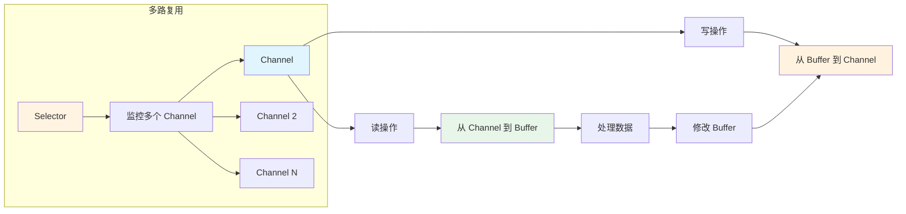
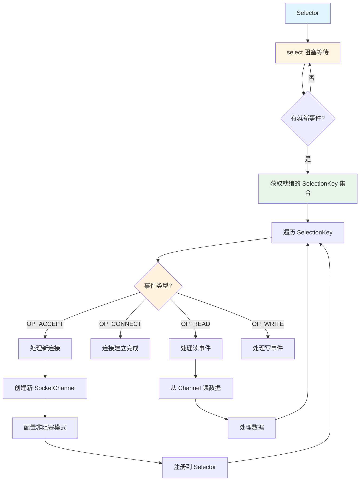
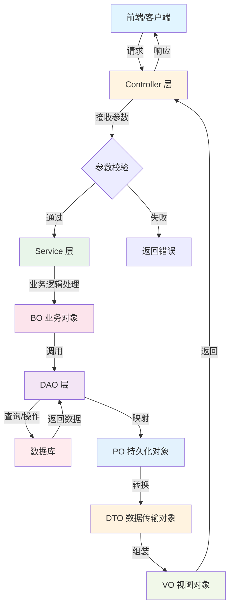
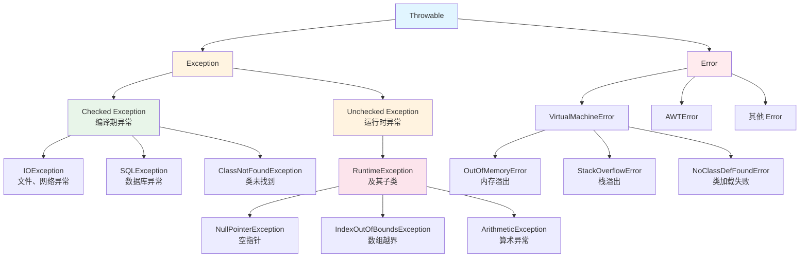
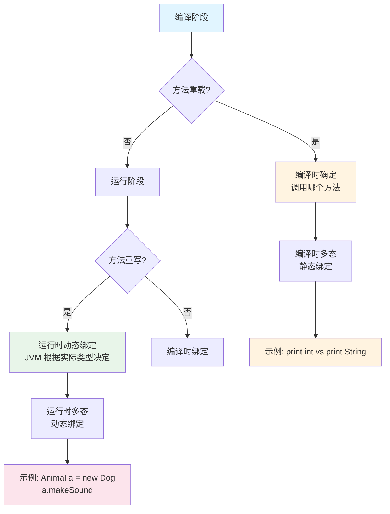
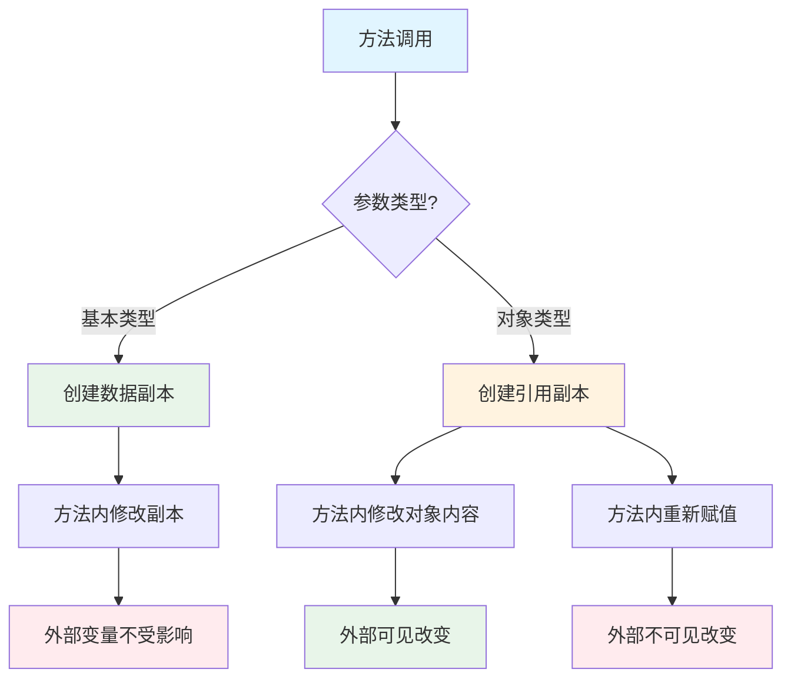

# Java 刷题记录 - 2026年4月1日

> 作者：秋霁
> 学习日期：2026年4月1日

---

## 📚 题库目录

> 💡 [点击这里查看测试代码](TestCode2026-04-01/README.md) - 所有题目的完整可运行代码

| 题号 | 题目 | 测试代码 |
|------|------|---------|
| 1 | [Java 中 for 循环与 foreach 循环的区别是什么](#1-java-中-for-循环与-foreach-循环的区别是什么) | [Question01_ForForeach.java](TestCode2026-04-01/Question01_ForForeach.java) |
| 2 | [Java 中 wait() 和 sleep() 的区别](#2-java-中-wait-和-sleep-的区别) | [Question02_WaitSleep.java](TestCode2026-04-01/Question02_WaitSleep.java) |
| 3 | [Java Object 类中有什么方法，有什么作用](#3-java-object-类中有什么方法有什么作用) | [Question03_ObjectMethods.java](TestCode2026-04-01/Question03_ObjectMethods.java) |

---

## 1. Java 中 for 循环与 foreach 循环的区别是什么

### 📌 回答重点

Java 里的 for 和 foreach 看似都能遍历，但底层机制和适用场景其实有挺大差别。

**核心区别：**

| 特性 | 传统 for 循环 | foreach（增强 for） |
|------|-------------|-------------------|
| 底层机制 | 索引控制 | 迭代器（Iterator）的语法糖 |
| 代码简洁性 | 需要管理下标 | 屏蔽索引细节，更简洁 |
| 访问索引 | ✅ 可以访问索引 | ❌ 无法访问索引 |
| 集合修改 | ✅ 可以修改 | ❌ 不能在遍历时修改集合 |
| 适用场景 | 需要索引或复杂控制 | 简单遍历，代码更安全 |

---

### 💡 面试官最爱问的4个细节

#### 1) 传统 for 循环：靠索引控制

**特点：**
- 需要自己管理下标
- 适合需要访问索引的场景
- 可以反向遍历、跳步等

**代码示例：**

```java
// 基本遍历
for (int i = 0; i < arr.length; i++) {
    System.out.println(arr[i]);
}

// 处理偶数位元素
for (int i = 0; i < arr.length; i += 2) {
    System.out.println("偶数位：" + arr[i]);
}

// 反向遍历
for (int i = arr.length - 1; i >= 0; i--) {
    System.out.println("反向：" + arr[i]);
}

// List 同样适用
List<String> list = new ArrayList<>();
for (int i = 0; i < list.size(); i++) {
    String s = list.get(i);
    // 可以根据索引做特殊处理
    if (i % 2 == 0) {
        System.out.println("偶数索引：" + s);
    }
}
```

**适用场景：**
- 需要访问当前元素的索引
- 需要反向遍历
- 需要跳步遍历（i += 2）
- 需要在遍历时修改集合

---

#### 2) foreach（增强 for）：迭代器的语法糖

**特点：**
- 本质是 Iterator 的语法糖
- 编译后会转成 `Iterator` 的 `hasNext()` 和 `next()` 调用
- 屏蔽索引细节，代码更简洁
- 避免越界错误

**代码示例：**

```java
// 遍历数组
String[] arr = {"A", "B", "C"};
for (String s : arr) {
    System.out.println(s);
}

// 遍历 List
List<String> list = new ArrayList<>();
for (String s : list) {
    System.out.println(s);
}

// 遍历 Set
Set<String> set = new HashSet<>();
for (String s : set) {
    System.out.println(s);
}
```

**编译后的代码（反编译）：**

```java
// foreach 代码
for (String s : list) {
    System.out.println(s);
}

// 编译后实际是这样的
Iterator<String> iterator = list.iterator();
while (iterator.hasNext()) {
    String s = iterator.next();
    System.out.println(s);
}
```

**优点：**
- ✅ 代码简洁，可读性强
- ✅ 不会数组越界
- ✅ 适用于所有 Iterable 集合

**缺点：**
- ❌ 无法访问索引
- ❌ 不能在遍历时删除元素（会抛异常）
- ❌ 不能反向遍历或跳步

---

#### 3) 性能差异分析

**数组类型：**

```java
int[] arr = new int[1000];

// 传统 for
for (int i = 0; i < arr.length; i++) {
    // 直接索引访问，很快
    arr[i] = i;
}

// foreach
for (int num : arr) {
    // 底层也是索引访问，性能基本没差
    System.out.println(num);
}
```

**ArrayList（实现了 RandomAccess 接口）：**

```java
List<Integer> list = new ArrayList<>();

// 传统 for：通过 get(i) 访问
for (int i = 0; i < list.size(); i++) {
    // 时间复杂度：O(1)
    // ArrayList 底层是数组，get(i) 很快
    Integer num = list.get(i);
}

// foreach：迭代器遍历
for (Integer num : list) {
    // 时间复杂度：O(n)
    // 也是 O(n)，但代码更简洁
}
```

**LinkedList（未实现 RandomAccess）：**

```java
List<Integer> linkedList = new LinkedList<>();

// ❌ 传统 for：不推荐！
for (int i = 0; i < linkedList.size(); i++) {
    // 时间复杂度：O(n²)
    // 每次 get(i) 都要从头遍历，性能很差
    Integer num = linkedList.get(i);
}

// ✅ foreach：推荐！
for (Integer num : linkedList) {
    // 时间复杂度：O(n)
    // 使用迭代器，一次遍历完成
}
```

**性能总结：**

| 数据结构 | 传统 for | foreach | 推荐 |
|---------|---------|---------|------|
| 数组 | O(n) | O(n) | 都可以，foreach 更简洁 |
| ArrayList | O(n) | O(n) | foreach 更简洁 |
| LinkedList | O(n²) | O(n) | **必须用 foreach** |
| HashSet/TreeSet | 不支持 | O(n) | 只能用 foreach |

**RandomAccess 接口的作用：**

```java
// 判断是否支持随机访问
if (list instanceof RandomAccess) {
    // ArrayList：可以用传统 for，性能好
    for (int i = 0; i < list.size(); i++) {
        System.out.println(list.get(i));
    }
} else {
    // LinkedList：用 foreach 更好
    for (String s : list) {
        System.out.println(s);
    }
}
```

---

#### 4) foreach 的限制和陷阱

**陷阱1：不能在遍历时删除元素**

```java
List<String> list = new ArrayList<>(Arrays.asList("A", "B", "C"));

// ❌ 错误：foreach 中删除元素
for (String s : list) {
    if (s.equals("B")) {
        list.remove(s);  // ConcurrentModificationException
    }
}

// ✅ 正确：使用迭代器的 remove()
Iterator<String> iterator = list.iterator();
while (iterator.hasNext()) {
    String s = iterator.next();
    if (s.equals("B")) {
        iterator.remove();  // 正确删除
    }
}

// ✅ 正确：使用 removeIf（Java 8+）
list.removeIf(s -> s.equals("B"));
```

**为什么 foreach 删除会抛异常？**

```java
// foreach 底层是迭代器
for (String s : list) {
    if (s.equals("B")) {
        list.remove(s);  // 直接操作集合
    }
}

// 等价于
Iterator<String> iterator = list.iterator();
while (iterator.hasNext()) {
    String s = iterator.next();
    if (s.equals("B")) {
        list.remove(s);  // 调用集合的 remove()
        // 迭代器检测到集合被修改（不是通过迭代器）
        // 下次 hasNext() 或 next() 时抛异常
    }
}
```

**ConcurrentModificationException 的工作原理：**

- 集合维护一个 `modCount` 字段
- 迭代器创建时记录当前的 `modCount`
- 每次调用 `next()` 前检查 `modCount` 是否变化
- 如果变化了，说明集合被修改，抛异常

---

**陷阱2：不能在遍历时修改元素（List）**

```java
List<String> list = new ArrayList<>(Arrays.asList("A", "B", "C"));

// ❌ 错误：foreach 中修改元素
for (String s : list) {
    s = s + " Modified";  // 只修改了局部变量 s
}
// list 内容不变：[A, B, C]

// ✅ 正确：使用索引
for (int i = 0; i < list.size(); i++) {
    list.set(i, list.get(i) + " Modified");
}
// list 内容：[A Modified, B Modified, C Modified]

// ✅ 正确：使用 ListIterator
ListIterator<String> iterator = list.listIterator();
while (iterator.hasNext()) {
    String s = iterator.next();
    iterator.set(s + " Modified");
}
```

---

**陷阱3：不能用于跳步或反向遍历**

```java
int[] arr = {1, 2, 3, 4, 5, 6, 7, 8, 9, 10};

// ❌ foreach 不能跳步
// for (int num : arr) { ... }  // 只能按顺序遍历

// ✅ 传统 for 可以跳步
for (int i = 0; i < arr.length; i += 2) {
    System.out.println(arr[i]);  // 输出：1, 3, 5, 7, 9
}

// ❌ foreach 不能反向
// for (int num : arr) { ... }  // 只能正向

// ✅ 传统 for 可以反向
for (int i = arr.length - 1; i >= 0; i--) {
    System.out.println(arr[i]);  // 输出：10, 9, 8, ..., 1
}
```

---

### 📝 总结

| 特性 | 传统 for | foreach |
|------|---------|---------|
| 索引访问 | ✅ 支持 | ❌ 不支持 |
| 反向遍历 | ✅ 支持 | ❌ 不支持 |
| 跳步遍历 | ✅ 支持 | ❌ 不支持 |
| 修改集合 | ✅ 支持 | ❌ 不支持（需用迭代器） |
| 代码简洁 | ⭐⭐ | ⭐⭐⭐⭐⭐ |
| 性能 | ArrayList: O(n)<br/>LinkedList: O(n²) | 所有集合: O(n) |
| 适用性 | 数组、List | 任意 Iterable |

---

### 🔍 拓展知识：如何选择

#### 选择原则

```
┌─────────────────────────────────────┐
│    需要索引或复杂控制逻辑？          │
└──────────────┬──────────────────────┘
               │
       ┌───────┴───────┐
       │               │
      是              否
       │               │
       ↓               ↓
   传统 for         遍历 List？
       │               │
       │       ┌───────┴───────┐
       │       │               │
       │   ArrayList      LinkedList/其他
       │       │               │
       │   都可以          必须用 foreach
       │       │
       │   推荐用 foreach（代码简洁）
```

#### 实际应用示例

**示例1：统计偶数个数（需要索引）**

```java
int[] nums = {1, 2, 3, 4, 5, 6, 7, 8, 9, 10};
int count = 0;

// 传统 for
for (int i = 0; i < nums.length; i++) {
    if (nums[i] % 2 == 0) {
        count++;
        System.out.println("偶数在索引：" + i);
    }
}

// foreach：无法知道索引
for (int num : nums) {
    if (num % 2 == 0) {
        count++;
        // 无法输出索引
    }
}
```

**示例2：删除满足条件的元素**

```java
List<String> list = new ArrayList<>(Arrays.asList("A", "B", "C", "D"));

// ❌ 错误：foreach 删除
for (String s : list) {
    if (s.equals("B")) {
        list.remove(s);  // ConcurrentModificationException
    }
}

// ✅ 正确：removeIf（Java 8+）
list.removeIf(s -> s.equals("B"));

// ✅ 正确：迭代器
Iterator<String> iterator = list.iterator();
while (iterator.hasNext()) {
    String s = iterator.next();
    if (s.equals("B")) {
        iterator.remove();
    }
}
```

**示例3：遍历 Map**

```java
Map<String, Integer> map = new HashMap<>();
map.put("A", 1);
map.put("B", 2);
map.put("C", 3);

// 方式1：遍历键值对（推荐）
for (Map.Entry<String, Integer> entry : map.entrySet()) {
    String key = entry.getKey();
    Integer value = entry.getValue();
    System.out.println(key + " = " + value);
}

// 方式2：遍历键
for (String key : map.keySet()) {
    Integer value = map.get(key);
    System.out.println(key + " = " + value);
}

// 方式3：遍历值
for (Integer value : map.values()) {
    System.out.println(value);
}
```

---

### ⚠️ 最佳实践

```java
// 1. 简单遍历，优先用 foreach
for (String s : list) {
    System.out.println(s);
}

// 2. 需要索引，用传统 for
for (int i = 0; i < list.size(); i++) {
    System.out.println(i + ": " + list.get(i));
}

// 3. 需要删除元素，用 removeIf 或迭代器
list.removeIf(s -> s.length() > 5);

// 4. LinkedList 必须用 foreach
for (String s : linkedList) {
    System.out.println(s);
}

// 5. 判断是否支持随机访问
if (list instanceof RandomAccess) {
    // 可以用传统 for
    for (int i = 0; i < list.size(); i++) {
        System.out.println(list.get(i));
    }
} else {
    // 用 foreach
    for (String s : list) {
        System.out.println(s);
    }
}
```

---

### 🎯 记忆口诀

> **能 foreach 就 foreach，代码简洁又安全**
> **需要索引用 for，性能 LinkedList 选 foreach**
> **删除元素用迭代器，或者直接 removeIf**

---

## 2. Java 中 wait() 和 sleep() 的区别

### 📌 回答重点

`wait()` 和 `sleep()` 看起来都是让线程"停下来"，但它们的使用场景和底层机制完全不同。

**核心区别：**

| 特性 | wait() | sleep() |
|------|--------|---------|
| 所属类 | `Object` 类的方法 | `Thread` 类的静态方法 |
| 锁的释放 | ✅ 释放锁 | ❌ 不释放锁 |
| 使用位置 | 必须在 synchronized 块中 | 任意位置 |
| 唤醒方式 | 被 `notify()` 或 `notifyAll()` 唤醒 | 时间到了自动唤醒 |
| 中断处理 | 需要捕获 `InterruptedException` | 需要捕获 `InterruptedException` |
| 使用场景 | 线程间协作（生产者-消费者） | 简单暂停线程 |

---

### 💡 面试官最爱问的4个细节

#### 1) wait()：线程间协作机制

**特点：**
- `wait()` 是 `Object` 类的方法
- 调用后会释放持有的监视器锁（monitor lock）
- 进入等待队列，等待其他线程唤醒
- 必须在 `synchronized` 块或方法中使用

**代码示例：**

```java
public class WaitExample {
    private static final Object lock = new Object();
    
    public static void main(String[] args) {
        // 线程1：等待
        Thread thread1 = new Thread(() -> {
            synchronized (lock) {
                System.out.println("线程1：获取锁，准备等待...");
                try {
                    lock.wait();  // 释放锁，进入等待队列
                    System.out.println("线程1：被唤醒了！");
                } catch (InterruptedException e) {
                    Thread.currentThread().interrupt();
                }
                System.out.println("线程1：继续执行");
            }
        });
        
        // 线程2：唤醒
        Thread thread2 = new Thread(() -> {
            try {
                Thread.sleep(1000);  // 先休眠1秒
            } catch (InterruptedException e) {
                e.printStackTrace();
            }
            synchronized (lock) {
                System.out.println("线程2：获取锁，准备唤醒...");
                lock.notify();  // 唤醒等待队列中的一个线程
                System.out.println("线程2：已发送唤醒信号");
            }
        });
        
        thread1.start();
        thread2.start();
    }
}
```

**输出：**
```
线程1：获取锁，准备等待...
线程2：获取锁，准备唤醒...
线程2：已发送唤醒信号
线程1：被唤醒了！
线程1：继续执行
```

**关键点：**
- `wait()` 释放锁，其他线程可以获取锁
- `notify()` 唤醒一个等待的线程
- 被唤醒的线程需要重新获取锁才能继续执行

---

#### 2) sleep()：简单的线程暂停

**特点：**
- `sleep()` 是 `Thread` 类的静态方法
- 只是让当前线程暂停指定时间
- 不释放任何锁
- 时间到了自动进入就绪状态

**代码示例：**

```java
public class SleepExample {
    private static final Object lock = new Object();
    
    public static void main(String[] args) {
        // 线程1：持有锁并休眠
        Thread thread1 = new Thread(() -> {
            synchronized (lock) {
                System.out.println("线程1：获取锁，准备休眠...");
                try {
                    Thread.sleep(2000);  // 休眠2秒，但不释放锁
                    System.out.println("线程1：休眠结束，继续执行");
                } catch (InterruptedException e) {
                    Thread.currentThread().interrupt();
                }
            }
            System.out.println("线程1：释放锁");
        });
        
        // 线程2：等待获取锁
        Thread thread2 = new Thread(() -> {
            synchronized (lock) {
                System.out.println("线程2：获取锁了！");
            }
        });
        
        thread1.start();
        thread2.start();
    }
}
```

**输出：**
```
线程1：获取锁，准备休眠...
线程1：休眠结束，继续执行
线程1：释放锁
线程2：获取锁了！
```

**关键点：**
- `sleep()` 不释放锁
- 线程2必须等待线程1休眠结束并释放锁
- 适用于简单的暂停，不需要线程协作

---

#### 3) wait() 与 sleep() 的详细对比

**代码对比：**

```java
public class WaitSleepComparison {
    private static final Object lock = new Object();
    
    public static void main(String[] args) throws InterruptedException {
        // wait() 示例
        System.out.println("===== wait() 示例 =====");
        synchronized (lock) {
            System.out.println("1. 获取锁");
            try {
                lock.wait(1000);  // 等待1秒或被唤醒
                System.out.println("4. 被唤醒或超时，重新获取锁");
            } catch (InterruptedException e) {
                Thread.currentThread().interrupt();
            }
            System.out.println("5. 执行完毕，释放锁");
        }
        
        // sleep() 示例
        System.out.println("\n===== sleep() 示例 =====");
        synchronized (lock) {
            System.out.println("1. 获取锁");
            try {
                Thread.sleep(1000);  // 休眠1秒
                System.out.println("2. 休眠结束，继续持有锁");
            } catch (InterruptedException e) {
                Thread.currentThread().interrupt();
            }
            System.out.println("3. 执行完毕，释放锁");
        }
    }
}
```

**wait() 流程：**
```
1. 获取锁
2. 调用 wait()
3. 释放锁，进入等待队列
4. 等待被唤醒或超时
5. 被唤醒后重新获取锁
6. 继续执行
```

**sleep() 流程：**
```
1. 获取锁
2. 调用 sleep()
3. 保持锁，线程休眠
4. 休眠结束
5. 继续执行
6. 释放锁
```

---

#### 4) 实际应用场景

**场景1：生产者-消费者模式（用 wait/notify）**

```java
import java.util.LinkedList;
import java.util.Queue;

public class ProducerConsumer {
    private static final int MAX_SIZE = 5;
    private final Queue<Integer> queue = new LinkedList<>();
    
    // 生产者
    public void produce(int value) throws InterruptedException {
        synchronized (queue) {
            // 队列满时等待
            while (queue.size() >= MAX_SIZE) {
                System.out.println("队列已满，生产者等待...");
                queue.wait();
            }
            
            queue.add(value);
            System.out.println("生产: " + value + "，队列大小: " + queue.size());
            queue.notifyAll();  // 唤醒消费者
        }
    }
    
    // 消费者
    public void consume() throws InterruptedException {
        synchronized (queue) {
            // 队列空时等待
            while (queue.isEmpty()) {
                System.out.println("队列为空，消费者等待...");
                queue.wait();
            }
            
            int value = queue.poll();
            System.out.println("消费: " + value + "，队列大小: " + queue.size());
            queue.notifyAll();  // 唤醒生产者
        }
    }
    
    public static void main(String[] args) {
        ProducerConsumer pc = new ProducerConsumer();
        
        // 生产者线程
        Thread producer = new Thread(() -> {
            for (int i = 1; i <= 10; i++) {
                try {
                    pc.produce(i);
                    Thread.sleep(100);  // 模拟生产耗时
                } catch (InterruptedException e) {
                    Thread.currentThread().interrupt();
                }
            }
        });
        
        // 消费者线程
        Thread consumer = new Thread(() -> {
            for (int i = 1; i <= 10; i++) {
                try {
                    pc.consume();
                    Thread.sleep(200);  // 模拟消费耗时
                } catch (InterruptedException e) {
                    Thread.currentThread().interrupt();
                }
            }
        });
        
        producer.start();
        consumer.start();
    }
}
```

**场景2：简单延时（用 sleep）**

```java
public class SimpleDelay {
    public static void main(String[] args) {
        System.out.println("开始执行...");
        
        // 简单延时2秒
        try {
            System.out.println("暂停2秒...");
            Thread.sleep(2000);
        } catch (InterruptedException e) {
            Thread.currentThread().interrupt();
            System.out.println("休眠被中断");
        }
        
        System.out.println("继续执行...");
        
        // 定时任务示例
        for (int i = 1; i <= 5; i++) {
            System.out.println("执行第 " + i + " 次任务");
            try {
                Thread.sleep(1000);  // 每次间隔1秒
            } catch (InterruptedException e) {
                Thread.currentThread().interrupt();
                break;
            }
        }
    }
}
```

---

### 📝 总结

| 特性 | wait() | sleep() |
|------|--------|---------|
| 所属类 | `Object` | `Thread` |
| 调用方式 | `obj.wait()` | `Thread.sleep()` |
| 锁的释放 | ✅ 释放锁 | ❌ 不释放锁 |
| 必须在 synchronized 中 | ✅ 是 | ❌ 否 |
| 唤醒方式 | `notify()` / `notifyAll()` | 时间到自动唤醒 |
| 使用场景 | 线程间协作 | 简单暂停 |
| 典型应用 | 生产者-消费者 | 定时任务、延时 |

---

### 🔍 拓展知识：常见陷阱

#### 陷阱1：wait() 必须在 synchronized 块中

```java
public class WaitTrap {
    private static final Object lock = new Object();
    
    // ❌ 错误：不在 synchronized 块中调用 wait()
    public static void wrongWay() {
        try {
            lock.wait();  // IllegalMonitorStateException
        } catch (InterruptedException e) {
            Thread.currentThread().interrupt();
        }
    }
    
    // ✅ 正确：在 synchronized 块中调用 wait()
    public static void rightWay() {
        synchronized (lock) {
            try {
                lock.wait();
            } catch (InterruptedException e) {
                Thread.currentThread().interrupt();
            }
        }
    }
}
```

---

#### 陷阱2：wait() 被唤醒后需要重新获取锁

```java
public class WaitLockExample {
    private static final Object lock = new Object();
    
    public static void main(String[] args) {
        Thread waitingThread = new Thread(() -> {
            synchronized (lock) {
                System.out.println("等待线程：获取锁");
                try {
                    lock.wait();
                    System.out.println("等待线程：被唤醒，但还没重新获取锁");
                } catch (InterruptedException e) {
                    Thread.currentThread().interrupt();
                }
                System.out.println("等待线程：重新获取锁，继续执行");
            }
        });
        
        Thread notifyingThread = new Thread(() -> {
            try {
                Thread.sleep(1000);
            } catch (InterruptedException e) {
                e.printStackTrace();
            }
            synchronized (lock) {
                System.out.println("通知线程：获取锁");
                lock.notify();  // 发送唤醒信号
                System.out.println("通知线程：继续持有锁，做其他事情...");
                try {
                    Thread.sleep(1000);  // 持有锁1秒
                } catch (InterruptedException e) {
                    e.printStackTrace();
                }
                System.out.println("通知线程：释放锁");
            }
        });
        
        waitingThread.start();
        notifyingThread.start();
    }
}
```

**输出：**
```
等待线程：获取锁
通知线程：获取锁
通知线程：继续持有锁，做其他事情...
通知线程：释放锁
等待线程：被唤醒，但还没重新获取锁
等待线程：重新获取锁，继续执行
```

**说明：** 被唤醒的线程必须等待通知线程释放锁后才能继续执行。

---

#### 陷阱3：notify() vs notifyAll()

```java
public class NotifyExample {
    private static final Object lock = new Object();
    
    public static void main(String[] args) {
        // 创建多个等待线程
        for (int i = 1; i <= 3; i++) {
            final int id = i;
            Thread thread = new Thread(() -> {
                synchronized (lock) {
                    System.out.println("线程" + id + "：开始等待");
                    try {
                        lock.wait();
                        System.out.println("线程" + id + "：被唤醒！");
                    } catch (InterruptedException e) {
                        Thread.currentThread().interrupt();
                    }
                }
            });
            thread.start();
        }
        
        try {
            Thread.sleep(1000);
        } catch (InterruptedException e) {
            e.printStackTrace();
        }
        
        synchronized (lock) {
            System.out.println("\n主线程：发送唤醒信号");
            // lock.notify();  // 只唤醒一个线程
            lock.notifyAll();  // 唤醒所有线程
        }
    }
}
```

**区别：**
- `notify()`：唤醒等待队列中的一个线程（随机）
- `notifyAll()`：唤醒等待队列中的所有线程
- 推荐：一般使用 `notifyAll()` 更安全

---

### ⚠️ 最佳实践

```java
// 1. 使用 wait/notify 实现线程协作
synchronized (lock) {
    while (condition) {  // 使用 while 而非 if
        lock.wait();
    }
    // 执行业务逻辑
}

// 2. 使用 sleep 实现简单延时
try {
    Thread.sleep(1000);  // 暂停1秒
} catch (InterruptedException e) {
    Thread.currentThread().interrupt();
}

// 3. 捕获中断异常后恢复中断状态
try {
    Thread.sleep(1000);
} catch (InterruptedException e) {
    Thread.currentThread().interrupt();  // 恢复中断状态
}

// 4. 使用 wait(long timeout) 设置超时
synchronized (lock) {
    lock.wait(5000);  // 最多等待5秒
}
```

---

### 🎯 记忆口诀

> **wait 要释放锁，配合 notify 协作强**
> **sleep 不释放锁，简单暂停用它帮**
> **线程协作用 wait，定时任务用 sleep**
> **wait 必须在同步块，sleep 随处都能放**

---

## 3. Java Object 类中有什么方法，有什么作用

### 📌 回答重点

每个 Java 类都默认继承 Object，它提供的方法是 JVM 和语言层面协作的结果。这些方法构成了对象行为的基础，像 `equals`、`hashCode` 这种在集合类里天天用。

**Object 类的核心方法：**

| 方法 | 作用 | 是否可重写 |
|------|------|-----------|
| `equals(Object obj)` | 判断两个对象是否逻辑相等 | ✅ 可重写 |
| `hashCode()` | 返回对象的哈希码 | ✅ 可重写 |
| `toString()` | 返回对象的字符串表示 | ✅ 可重写 |
| `clone()` | 创建并返回对象的拷贝 | ✅ 可重写 |
| `getClass()` | 返回运行时类对象 | ❌ final 方法 |
| `wait()` / `notify()` / `notifyAll()` | 线程间通信 | ✅ 可重写（但不推荐） |
| `finalize()` | 对象被回收前可能调用 | ✅ 可重写（已废弃） |

---

### 💡 面试官最爱问的7个方法

#### 1) equals(Object obj) - 判断对象是否相等

**作用：** 判断两个对象是否逻辑相等

**默认实现：** 使用 `==` 比较，比较的是对象地址

**需要满足的契约（Java 规范）：**

| 特性 | 说明 | 示例 |
|------|------|------|
| 自反性 | x.equals(x) 必须为 true | `a.equals(a)` → true |
| 对称性 | x.equals(y) 等于 y.equals(x) | `a.equals(b)` = `b.equals(a)` |
| 传递性 | x.equals(y) && y.equals(z) → x.equals(z) | 级联相等 |
| 一致性 | 多次调用结果一致 | 除非对象修改 |
| 非空性 | 任何非空对象不等于 null | `a.equals(null)` → false |

**代码示例：**

```java
// 默认实现：比较地址
Object obj1 = new Object();
Object obj2 = new Object();
System.out.println(obj1.equals(obj2));  // false（地址不同）

// 重写 equals：按值比较
class Person {
    private String name;
    private int age;
    
    public Person(String name, int age) {
        this.name = name;
        this.age = age;
    }
    
    @Override
    public boolean equals(Object obj) {
        if (this == obj) return true;  // 自反性
        if (obj == null || getClass() != obj.getClass()) return false;
        Person person = (Person) obj;
        return age == person.age && Objects.equals(name, person.name);
    }
}

Person p1 = new Person("张三", 25);
Person p2 = new Person("张三", 25);
System.out.println(p1.equals(p2));  // true（值相同）
```

**String 的 equals 实现：**

```java
// String 已重写 equals，按内容比较
String s1 = new String("Hello");
String s2 = new String("Hello");
System.out.println(s1.equals(s2));  // true（内容相同）
System.out.println(s1 == s2);        // false（地址不同）
```

**注意事项：**
- 重写 `equals` 时必须重写 `hashCode`
- 使用 `Objects.equals(a, b)` 避免空指针
- 使用 `Objects.hash()` 生成哈希码

---

#### 2) hashCode() - 返回对象的哈希码

**作用：** 返回对象的哈希码，用于 HashMap、HashSet 等散列表定位桶位置

**默认实现：** 根据对象地址计算哈希码（native 方法）

**重要规则：**
1. **相等的对象必须有相同的哈希码**（equals 为 true，hashCode 必须相同）
2. **哈希码相同，对象不一定相等**（哈希冲突）

**代码示例：**

```java
// 默认 hashCode：基于地址
Object obj1 = new Object();
Object obj2 = new Object();
System.out.println(obj1.hashCode());  // 随机值
System.out.println(obj2.hashCode());  // 随机值（不同）

// 重写 hashCode：基于内容
class Person {
    private String name;
    private int age;
    
    @Override
    public boolean equals(Object obj) {
        if (this == obj) return true;
        if (obj == null || getClass() != obj.getClass()) return false;
        Person person = (Person) obj;
        return age == person.age && Objects.equals(name, person.name);
    }
    
    @Override
    public int hashCode() {
        return Objects.hash(name, age);
    }
}

Person p1 = new Person("张三", 25);
Person p2 = new Person("张三", 25);
System.out.println(p1.equals(p2));        // true
System.out.println(p1.hashCode() == p2.hashCode());  // true
```

**为什么重写 equals 必须重写 hashCode？**

```java
class Student {
    private String id;
    
    public Student(String id) {
        this.id = id;
    }
    
    // 只重写 equals，没重写 hashCode
    @Override
    public boolean equals(Object obj) {
        if (this == obj) return true;
        if (obj == null || getClass() != obj.getClass()) return false;
        Student student = (Student) obj;
        return Objects.equals(id, student.id);
    }
}

// 问题：无法从 HashMap 中获取对象
Map<Student, String> map = new HashMap<>();
Student s1 = new Student("001");
Student s2 = new Student("001");

map.put(s1, "张三");
System.out.println(map.containsKey(s2));  // false！（找不到）
System.out.println(map.get(s2));         // null

// 原因：s1 和 s2 的 hashCode 不同，存储在不同桶中
System.out.println(s1.hashCode());
System.out.println(s2.hashCode());
```

**正确的做法：**

```java
class Student {
    private String id;
    
    @Override
    public boolean equals(Object obj) {
        if (this == obj) return true;
        if (obj == null || getClass() != obj.getClass()) return false;
        Student student = (Student) obj;
        return Objects.equals(id, student.id);
    }
    
    @Override
    public int hashCode() {
        return Objects.hash(id);  // 相同的 id 生成相同的 hashCode
    }
}

// 现在可以正常使用 HashMap
Map<Student, String> map = new HashMap<>();
Student s1 = new Student("001");
Student s2 = new Student("001");

map.put(s1, "张三");
System.out.println(map.containsKey(s2));  // true
System.out.println(map.get(s2));         // 张三
```

---

#### 3) toString() - 返回对象的字符串表示

**作用：** 返回对象的字符串表示，打印对象或字符串拼接时自动调用

**默认实现：** `getClass().getName() + '@' + Integer.toHexString(hashCode())`

**示例：**

```java
// 默认 toString：输出地址
Object obj = new Object();
System.out.println(obj);  // java.lang.Object@6504e311

// 重写 toString：输出有用信息
class Person {
    private String name;
    private int age;
    
    public Person(String name, int age) {
        this.name = name;
        this.age = age;
    }
    
    @Override
    public String toString() {
        return "Person{name='" + name + "', age=" + age + "}";
    }
}

Person person = new Person("张三", 25);
System.out.println(person);  // Person{name='张三', age=25}

// 字符串拼接
String msg = "用户信息：" + person;
System.out.println(msg);  // 用户信息：Person{name='张三', age=25}
```

**最佳实践：**

```java
// 使用 StringBuilder 构建（避免字符串拼接）
@Override
public String toString() {
    return new StringBuilder()
        .append("Person{")
        .append("name='").append(name).append('\'')
        .append(", age=").append(age)
        .append('}')
        .toString();
}

// 或者使用格式化字符串
@Override
public String toString() {
    return String.format("Person{name='%s', age=%d}", name, age);
}
```

---

#### 4) clone() - 创建对象的拷贝

**作用：** 创建并返回对象的拷贝

**使用条件：**
1. 实现 `Cloneable` 接口（标记接口）
2. 重写 `clone()` 方法，调用 `super.clone()`
3. 处理 `CloneNotSupportedException`

**浅拷贝 vs 深拷贝：**

```java
// 浅拷贝：只复制基本类型和引用地址
class ShallowCopyExample implements Cloneable {
    private int id;
    private String name;
    private int[] scores;  // 引用类型
    
    public ShallowCopyExample(int id, String name, int[] scores) {
        this.id = id;
        this.name = name;
        this.scores = scores;
    }
    
    @Override
    protected Object clone() throws CloneNotSupportedException {
        return super.clone();  // 浅拷贝
    }
}

ShallowCopyExample original = new ShallowCopyExample(1, "张三", new int[]{90, 85, 95});
ShallowCopyExample copy = (ShallowCopyExample) original.clone();

// 修改拷贝对象的数组
copy.getScores()[0] = 100;

// 原对象也被影响了（浅拷贝）
System.out.println(Arrays.toString(original.getScores()));  // [100, 85, 95]
```

```java
// 深拷贝：递归复制引用类型
class DeepCopyExample implements Cloneable {
    private int id;
    private String name;
    private int[] scores;
    
    public DeepCopyExample(int id, String name, int[] scores) {
        this.id = id;
        this.name = name;
        this.scores = scores;
    }
    
    @Override
    protected Object clone() throws CloneNotSupportedException {
        DeepCopyExample copy = (DeepCopyExample) super.clone();
        copy.scores = scores.clone();  // 深拷贝数组
        return copy;
    }
}

DeepCopyExample original = new DeepCopyExample(1, "张三", new int[]{90, 85, 95});
DeepCopyExample copy = (DeepCopyExample) original.clone();

// 修改拷贝对象的数组
copy.getScores()[0] = 100;

// 原对象不受影响（深拷贝）
System.out.println(Arrays.toString(original.getScores()));  // [90, 85, 95]
System.out.println(Arrays.toString(copy.getScores()));      // [100, 85, 95]
```

**注意事项：**
- `clone()` 是 protected 方法，只能在类内部或子类调用
- String 等不可变类不需要深拷贝
- 推荐使用拷贝构造器或工厂方法替代 clone

---

#### 5) getClass() - 返回运行时类对象

**作用：** 返回对象的运行时类对象（Class 对象）

**特点：** final 方法，不能被重写

**代码示例：**

```java
Object obj = new String("Hello");
Class<?> clazz = obj.getClass();
System.out.println(clazz.getName());      // java.lang.String
System.out.println(clazz.getSimpleName()); // String

// 获取类的各种信息
System.out.println(clazz.getPackage());   // package java.lang
System.out.println(clazz.getSuperclass()); // class java.lang.Object
System.out.println(clazz.getInterfaces()); // [interface java.io.Serializable...]

// 反射入口
try {
    // 通过类名获取 Class 对象
    Class<?> strClass = Class.forName("java.lang.String");
    
    // 创建实例
    Object instance = strClass.getDeclaredConstructor().newInstance();
    
    // 获取方法
    Method method = strClass.getMethod("length");
    int length = (int) method.invoke("Hello");
    System.out.println(length);  // 5
} catch (Exception e) {
    e.printStackTrace();
}
```

**应用场景：**
- 反射编程
- 动态加载类
- 获取类信息
- 框架开发

---

#### 6) wait() / notify() / notifyAll() - 线程间通信

**作用：** 配合 synchronized 实现线程间通信

**特点：**
- `wait()`：释放锁并挂起线程，直到被唤醒
- `notify()`：唤醒等待队列中的一个线程
- `notifyAll()`：唤醒等待队列中的所有线程
- 必须在 synchronized 块中使用

**代码示例：**

```java
public class WaitNotifyExample {
    private static final Object lock = new Object();
    private static boolean ready = false;
    
    public static void main(String[] args) {
        Thread producer = new Thread(() -> {
            synchronized (lock) {
                System.out.println("生产者：开始生产...");
                try {
                    Thread.sleep(1000);
                } catch (InterruptedException e) {
                    Thread.currentThread().interrupt();
                }
                ready = true;
                System.out.println("生产者：生产完成，通知消费者");
                lock.notify();  // 唤醒消费者
            }
        });
        
        Thread consumer = new Thread(() -> {
            synchronized (lock) {
                while (!ready) {
                    try {
                        System.out.println("消费者：等待中...");
                        lock.wait();  // 等待生产者唤醒
                    } catch (InterruptedException e) {
                        Thread.currentThread().interrupt();
                    }
                }
                System.out.println("消费者：消费完成");
            }
        });
        
        consumer.start();
        producer.start();
    }
}
```

**输出：**
```
消费者：等待中...
生产者：开始生产...
生产者：生产完成，通知消费者
消费者：消费完成
```

---

#### 7) finalize() - 对象被回收前可能调用的方法

**作用：** 对象被垃圾回收前可能调用的方法

**问题：**
- ❌ 不保证一定会执行
- ❌ 执行时间不确定
- ❌ 性能影响大
- ❌ Java 9 已废弃

**正确做法：**

```java
// ❌ 不推荐：使用 finalize
public class OldStyle {
    @Override
    protected void finalize() throws Throwable {
        try {
            // 关闭资源
        } finally {
            super.finalize();
        }
    }
}

// ✅ 推荐：使用 try-with-resources
public class NewStyle implements AutoCloseable {
    @Override
    public void close() {
        // 关闭资源
    }
}

// 使用
try (NewStyle resource = new NewStyle()) {
    // 使用资源
}  // 自动调用 close()

// ✅ 推荐：手动关闭
Connection conn = DriverManager.getConnection(url);
try {
    // 使用连接
} finally {
    if (conn != null) {
        conn.close();  // 手动关闭
    }
}
```

---

### 📝 总结

| 方法 | 作用 | 必须重写 | 典型应用 |
|------|------|---------|---------|
| `equals()` | 判断对象逻辑相等 | 配合hashCode | 集合查找 |
| `hashCode()` | 返回哈希码 | 配合equals | HashMap、HashSet |
| `toString()` | 字符串表示 | 建议重写 | 调试、日志 |
| `clone()` | 对象拷贝 | 需要深拷贝 | 对象复制 |
| `getClass()` | 获取类对象 | 不可重写 | 反射 |
| `wait/notify` | 线程通信 | 不推荐重写 | 线程协作 |
| `finalize()` | 资源释放 | 已废弃 | 不推荐使用 |

---

### 🔍 拓展知识：常见陷阱

#### 陷阱1：重写 equals 但没重写 hashCode

```java
class Student {
    private String id;
    
    @Override
    public boolean equals(Object obj) {
        // 正确的 equals 实现
        if (this == obj) return true;
        if (obj == null || getClass() != obj.getClass()) return false;
        Student student = (Student) obj;
        return Objects.equals(id, student.id);
    }
    
    // ❌ 忘记重写 hashCode
}

Set<Student> set = new HashSet<>();
Student s1 = new Student("001");
Student s2 = new Student("001");

set.add(s1);
set.add(s2);

System.out.println(set.size());  // 2（应该是1！）
```

**解决方案：**
```java
@Override
public int hashCode() {
    return Objects.hash(id);
}
```

---

#### 陷阱2：equals 参数类型错误

```java
class Person {
    private String name;
    
    // ❌ 错误：参数类型不对
    public boolean equals(Person other) {  // 重载，不是重写
        return this.name.equals(other.name);
    }
}

Person p1 = new Person("张三");
Object p2 = new Person("张三");

System.out.println(p1.equals(p2));  // true（调用自己的 equals）
System.out.println(p1.equals((Object)p2));  // false（调 Object 的 equals）
```

**解决方案：**
```java
@Override
public boolean equals(Object obj) {  // 正确：参数是 Object
    if (this == obj) return true;
    if (obj == null || getClass() != obj.getClass()) return false;
    Person other = (Person) obj;
    return Objects.equals(name, other.name);
}
```

---

#### 陷阱3：equals 违反对称性

```java
class CaseInsensitiveString {
    private String s;
    
    public CaseInsensitiveString(String s) {
        this.s = s;
    }
    
    @Override
    public boolean equals(Object obj) {
        if (obj instanceof CaseInsensitiveString) {
            return s.equalsIgnoreCase(((CaseInsensitiveString) obj).s);
        }
        if (obj instanceof String) {  // ❌ 错误：能和 String 比较
            return s.equalsIgnoreCase((String) obj);
        }
        return false;
    }
}

CaseInsensitiveString cis = new CaseInsensitiveString("Polish");
String s = "polish";

System.out.println(cis.equals(s));  // true
System.out.println(s.equals(cis));  // false！（不对称）
```

**解决方案：**
```java
@Override
public boolean equals(Object obj) {
    return obj instanceof CaseInsensitiveString &&
           ((CaseInsensitiveString) obj).s.equalsIgnoreCase(s);
}
```

---

### ⚠️ 最佳实践

```java
// 1. 使用 Objects 工具类
@Override
public boolean equals(Object obj) {
    if (this == obj) return true;
    if (obj == null || getClass() != obj.getClass()) return false;
    Person person = (Person) obj;
    return age == person.age && Objects.equals(name, person.name);
}

@Override
public int hashCode() {
    return Objects.hash(name, age);
}

// 2. 使用 StringBuilder 构建 toString
@Override
public String toString() {
    return new StringBuilder()
        .append("Person{")
        .append("name='").append(name).append('\'')
        .append(", age=").append(age)
        .append('}')
        .toString();
}

// 3. 使用 try-with-resources 替代 finalize
try (Connection conn = DriverManager.getConnection(url)) {
    // 使用连接
}  // 自动关闭

// 4. 使用拷贝构造器替代 clone
class Person {
    private String name;
    private int age;
    
    // 拷贝构造器
    public Person(Person other) {
        this.name = other.name;
        this.age = other.age;
    }
}

Person original = new Person("张三", 25);
Person copy = new Person(original);  // 深拷贝
```

---

### 🎯 记忆口诀

> **equals 判断逻辑值，hashCode 配合用**
> **toString 重写看内容，clone 深浅要分清**
> **getClass 反射用，wait/notify 线程通**
> **finalize 已废弃，try-with 替代它**

---

---

## 4、什么是 Channel？

### 📌 核心概念

**Channel 是 Java NIO 的核心组件**，可以看作是数据传输的通道，负责从缓冲区读写数据。

**关键特点：**
- **双向通道**：既能读也能写，而传统 IO 流一般是单向的
- **面向缓冲区**：数据总是流向 Buffer，Channel 本身不直接操作数据
- **多路复用**：配合 Selector 实现高并发

### 🔍 常见 Channel 实现

| Channel 类型 | 说明 | 使用场景 |
|-------------|------|----------|
| **FileChannel** | 文件通道 | 文件读写、文件锁、文件映射 |
| **SocketChannel** | TCP 客户端通道 | 客户端网络通信 |
| **ServerSocketChannel** | TCP 服务端通道 | 服务端监听连接 |
| **DatagramChannel** | UDP 通道 | 无连接的网络通信 |

> 💡 **实际应用**：Netty 就基于 NioSocketChannel 做网络通信，用统一的抽象屏蔽底层差异。

### 📊 Channel 工作流程图



### 🔄 Channel 与 Buffer 的交互模式

**读数据流程：**
```java
Channel → Buffer → 程序处理数据
```

**写数据流程：**
```java
程序处理数据 → Buffer → Channel
```

**优势：**
- ✅ 数据处理更灵活
- ✅ 便于零拷贝技术的应用
- ✅ 减少数据拷贝次数

### ⚡ Channel + Selector 多路复用

**传统 IO 模式：**
```
每个连接 → 一个线程 → 阻塞等待
结果：并发连接数 = 线程数（资源消耗大）
```

**NIO 多路复用模式：**
```
一个线程 + Selector → 监控多个 Channel
结果：一个线程处理几万并发连接（常见场景）
```

**事件类型：**
| 事件类型 | 说明 |
|---------|------|
| **OP_ACCEPT** | 有新连接到达（ServerSocketChannel） |
| **OP_CONNECT** | 连接建立完成（SocketChannel） |
| **OP_READ** | 数据可读 |
| **OP_WRITE** | 数据可写 |

### 💻 代码示例

#### 示例1：FileChannel 基本读写

```java
import java.io.*;
import java.nio.*;
import java.nio.channels.*;

// 1. 写文件
RandomAccessFile file = new RandomAccessFile("data.txt", "rw");
FileChannel channel = file.getChannel();

String data = "Hello, NIO Channel!";
ByteBuffer buffer = ByteBuffer.allocate(1024);
buffer.put(data.getBytes());
buffer.flip();  // 切换为读模式

channel.write(buffer);
channel.close();

// 2. 读文件
file = new RandomAccessFile("data.txt", "r");
channel = file.getChannel();

buffer = ByteBuffer.allocate(1024);
channel.read(buffer);
buffer.flip();  // 切换为读模式

System.out.println(new String(buffer.array(), 0, buffer.limit()));
channel.close();
```

#### 示例2：SocketChannel 客户端通信

```java
import java.nio.*;
import java.nio.channels.*;

// 打开 SocketChannel
SocketChannel channel = SocketChannel.open();
channel.configureBlocking(false);  // 配置为非阻塞模式
channel.connect(new InetSocketAddress("localhost", 8080));

while (!channel.finishConnect()) {
    // 等待连接完成
}

// 发送数据
ByteBuffer buffer = ByteBuffer.wrap("Hello Server".getBytes());
channel.write(buffer);

// 接收数据
buffer.clear();
int bytesRead = channel.read(buffer);
buffer.flip();
System.out.println(new String(buffer.array(), 0, bytesRead));

channel.close();
```

#### 示例3：ServerSocketChannel + Selector 多路复用

```java
import java.nio.*;
import java.nio.channels.*;
import java.util.*;

// 打开 ServerSocketChannel
ServerSocketChannel serverChannel = ServerSocketChannel.open();
serverChannel.configureBlocking(false);  // 必须配置为非阻塞模式
serverChannel.bind(new InetSocketAddress(8080));

// 打开 Selector
Selector selector = Selector.open();

// 注册到 Selector，监听 ACCEPT 事件
serverChannel.register(selector, SelectionKey.OP_ACCEPT);

while (true) {
    // 阻塞等待事件
    int readyCount = selector.select();
    
    // 获取所有就绪的 SelectionKey
    Set<SelectionKey> readyKeys = selector.selectedKeys();
    Iterator<SelectionKey> iterator = readyKeys.iterator();
    
    while (iterator.hasNext()) {
        SelectionKey key = iterator.next();
        iterator.remove();
        
        if (key.isAcceptable()) {
            // 处理连接事件
            ServerSocketChannel server = (ServerSocketChannel) key.channel();
            SocketChannel channel = server.accept();
            channel.configureBlocking(false);
            channel.register(selector, SelectionKey.OP_READ);
            
            System.out.println("新连接：" + channel);
            
        } else if (key.isReadable()) {
            // 处理读事件
            SocketChannel channel = (SocketChannel) key.channel();
            ByteBuffer buffer = ByteBuffer.allocate(1024);
            int bytesRead = channel.read(buffer);
            
            if (bytesRead == -1) {
                channel.close();
            } else {
                buffer.flip();
                System.out.println("收到数据：" + 
                    new String(buffer.array(), 0, bytesRead));
            }
        }
    }
}
```

### ⚠️ 注意事项

#### 1️⃣ 非阻塞模式必须配置

```java
// ❌ 错误：未配置非阻塞模式，注册到 Selector 会抛出异常
ServerSocketChannel channel = ServerSocketChannel.open();
channel.register(selector, SelectionKey.OP_ACCEPT);  // 抛出 IllegalBlockingModeException

// ✅ 正确：先配置为非阻塞模式
ServerSocketChannel channel = ServerSocketChannel.open();
channel.configureBlocking(false);  // 配置为非阻塞模式
channel.register(selector, SelectionKey.OP_ACCEPT);  // 正常工作
```

#### 2️⃣ Channel 必须关闭释放资源

```java
FileChannel channel = ...;
try {
    // 使用 channel
} finally {
    channel.close();  // 必须关闭，释放文件描述符
}
```

> ⚠️ **文件描述符资源宝贵**：Linux 下默认最多 1024 个，用完就报 `Too many open files`
>
> 解决方法：
> - 及时关闭 Channel
> - 调优系统参数：`ulimit -n 65535`

#### 3️⃣ Buffer 的 flip() 方法

```java
ByteBuffer buffer = ByteBuffer.allocate(1024);
channel.read(buffer);
// buffer.flip();  // ❌ 忘记 flip，读取的数据会出错
System.out.println(new String(buffer.array(), 0, buffer.limit()));

ByteBuffer buffer = ByteBuffer.allocate(1024);
channel.read(buffer);
buffer.flip();  // ✅ 正确：切换为读模式
System.out.println(new String(buffer.array(), 0, buffer.limit()));
```

### 🎯 最佳实践

#### 1️⃣ 使用 try-with-resources 自动关闭

```java
try (FileChannel channel = FileChannel.open(Paths.get("data.txt"), 
        StandardOpenOption.READ, StandardOpenOption.WRITE)) {
    // 使用 channel
}  // 自动关闭，释放资源
```

#### 2️⃣ 复用 Buffer 减少内存分配

```java
// ❌ 每次读写都创建新 Buffer
for (int i = 0; i < 1000; i++) {
    ByteBuffer buffer = ByteBuffer.allocate(1024);  // 浪费内存
    channel.read(buffer);
}

// ✅ 复用同一个 Buffer
ByteBuffer buffer = ByteBuffer.allocate(1024);
for (int i = 0; i < 1000; i++) {
    buffer.clear();
    channel.read(buffer);
}
```

#### 3️⃣ 使用 Selector 多路复用提升性能

```java
// ✅ 一个 Selector 管理多个 Channel
Selector selector = Selector.open();
serverChannel.register(selector, SelectionKey.OP_ACCEPT);
socketChannel.register(selector, SelectionKey.OP_READ);

while (true) {
    selector.select();  // 一次 select() 处理多个事件
    // 处理所有就绪的 Channel
}
```

### ❌ 常见误区

| 误区 | 说明 |
|------|------|
| **误区1：Channel 可以直接存储数据** | ❌ Channel 本身不存储数据，数据必须通过 Buffer 传输 |
| **误区2：阻塞模式也能注册到 Selector** | ❌ 必须配置为非阻塞模式才能注册到 Selector |
| **误区3：忘记 close Channel** | ❌ 会泄漏文件描述符，导致资源耗尽 |
| **误区4：忘记 flip() Buffer** | ❌ 读写切换时会读取到错误数据 |
| **误区5：一个 Channel 只能注册一次** | ❌ 可以用 `interestOps()` 动态修改注册的事件类型 |

### 🧠 记忆口诀

> **Channel 双向能读写，Buffer 传输是关键**
> **四种 Channel 分场景，File Socket Server UDP**
> **非阻塞配 Selector，多路复用扛并发**
> **记得 flip 切模式，及时关闭不泄漏**

---

---

## 5、什么是 Selector？

### 📌 核心概念

**Selector 是 Java NIO 里用来做事件监听的核心组件**，一个线程通过它就能同时监控多个通道的 I/O 状态，比如有没有数据可读、能不能写入。

**关键特点：**
- **单线程多路复用**：一个线程管理多个 Channel
- **事件驱动**：只处理就绪的 Channel，不轮询所有连接
- **非阻塞前提**：Channel 必须配置为非阻塞模式
- **高效轮询**：底层基于 epoll（Linux）或 kqueue（macOS）

### 🔥 传统 IO vs NIO + Selector

| 对比维度 | 传统 IO | NIO + Selector |
|---------|---------|----------------|
| **线程模型** | 一个连接一个线程 | 一个线程管理多个连接 |
| **并发能力** | 受线程数量限制 | 可处理数万并发连接 |
| **资源消耗** | 线程切换开销大 | 线程复用，开销小 |
| **适用场景** | 连接数少，每个连接处理时间长 | 高并发，短连接或空闲连接多 |

**实际案例：**
- **传统 IO**：1000 个连接需要 1000 个线程 → 系统扛不住
- **NIO + Selector**：1 个线程处理 10000 个连接 → 轻松应对

> 💡 **实际应用**：Netty、Dubbo、RocketMQ 等高性能中间件底层都靠 Selector 撑着。

### 📊 Selector 工作流程图



### 🎯 SelectionKey 与事件类型

每个 Channel 注册到 Selector 时都会绑定一个 **SelectionKey**，表示"我对哪些事件感兴趣"。

#### 事件类型表

| 事件类型 | 常量 | 说明 | 适用场景 |
|---------|------|------|----------|
| **OP_ACCEPT** | 16 | 有新连接到达 | ServerSocketChannel 监听新连接 |
| **OP_CONNECT** | 8 | 连接建立完成 | SocketChannel 客户端连接 |
| **OP_READ** | 1 | 数据可读 | 任意 Channel 接收数据 |
| **OP_WRITE** | 4 | 数据可写 | 任意 Channel 发送数据 |

#### SelectionKey 重要方法

```java
SelectionKey key = channel.register(selector, SelectionKey.OP_READ);

// 判断事件类型
key.isAcceptable();   // 是否有新连接
key.isConnectable();  // 连接是否完成
key.isReadable();     // 是否可读
key.isWritable();     // 是否可写

// 获取关联对象
key.channel();        // 获取对应的 Channel
key.selector();       // 获取对应的 Selector
key.attachment();     // 获取附加对象（可自定义）
```

### 💻 代码示例

#### 示例1：Selector 基本使用

```java
import java.nio.*;
import java.nio.channels.*;
import java.util.*;

// 1. 打开 Selector
Selector selector = Selector.open();

// 2. 配置 Channel 为非阻塞模式
ServerSocketChannel serverChannel = ServerSocketChannel.open();
serverChannel.configureBlocking(false);
serverChannel.bind(new InetSocketAddress(8080));

// 3. 注册到 Selector，监听 ACCEPT 事件
serverChannel.register(selector, SelectionKey.OP_ACCEPT);

// 4. 事件循环
while (true) {
    // 阻塞等待就绪事件（返回就绪的通道数）
    int readyCount = selector.select();
    
    if (readyCount == 0) {
        continue;  // 没有就绪事件
    }
    
    // 5. 获取所有就绪的 SelectionKey
    Set<SelectionKey> readyKeys = selector.selectedKeys();
    Iterator<SelectionKey> iterator = readyKeys.iterator();
    
    // 6. 遍历处理就绪事件
    while (iterator.hasNext()) {
        SelectionKey key = iterator.next();
        iterator.remove();  // 必须移除，避免重复处理
        
        if (key.isAcceptable()) {
            // 处理新连接
            ServerSocketChannel server = (ServerSocketChannel) key.channel();
            SocketChannel channel = server.accept();
            channel.configureBlocking(false);
            channel.register(selector, SelectionKey.OP_READ);
            
        } else if (key.isReadable()) {
            // 处理读事件
            SocketChannel channel = (SocketChannel) key.channel();
            ByteBuffer buffer = ByteBuffer.allocate(1024);
            int bytesRead = channel.read(buffer);
            
            if (bytesRead == -1) {
                channel.close();  // 连接关闭
            } else {
                buffer.flip();
                System.out.println("收到数据：" + 
                    new String(buffer.array(), 0, bytesRead));
            }
        }
    }
}
```

#### 示例2：动态修改感兴趣的事件

```java
// 1. 注册时只监听 OP_READ
SelectionKey key = channel.register(selector, SelectionKey.OP_READ);

// 2. 动态添加 OP_WRITE（需要先获取当前的事件类型）
int newInterestOps = key.interestOps() | SelectionKey.OP_WRITE;
key.interestOps(newInterestOps);

// 3. 取消 OP_WRITE
int removeWriteOps = key.interestOps() & ~SelectionKey.OP_WRITE;
key.interestOps(removeWriteOps);
```

#### 示例3：使用附加对象存储状态

```java
// 注册时附加对象
class ConnectionState {
    private SocketChannel channel;
    private ByteBuffer buffer;
    private String userId;
    // ... 其他状态
}

ConnectionState state = new ConnectionState(channel, buffer, "user001");
SelectionKey key = channel.register(selector, SelectionKey.OP_READ, state);

// 处理事件时获取附加对象
if (key.isReadable()) {
    ConnectionState state = (ConnectionState) key.attachment();
    // 使用 state 处理业务逻辑
}
```

#### 示例4：设置 select() 超时时间

```java
// 无限阻塞等待
selector.select();

// 设置超时（毫秒）
selector.select(1000);  // 最多等待 1 秒

// 非阻塞立即返回
selector.selectNow();  // 立即返回，不会阻塞
```

### ⚠️ 注意事项

#### 1️⃣ 非阻塞模式是前提

```java
// ❌ 错误：阻塞模式无法注册到 Selector
ServerSocketChannel channel = ServerSocketChannel.open();
channel.register(selector, SelectionKey.OP_ACCEPT);  
// 抛出 IllegalBlockingModeException

// ✅ 正确：必须先配置为非阻塞模式
ServerSocketChannel channel = ServerSocketChannel.open();
channel.configureBlocking(false);  // 配置为非阻塞
channel.register(selector, SelectionKey.OP_ACCEPT);  // 正常工作
```

#### 2️⃣ 必须移除已处理的 SelectionKey

```java
// ❌ 错误：不移除 SelectionKey
Set<SelectionKey> readyKeys = selector.selectedKeys();
Iterator<SelectionKey> iterator = readyKeys.iterator();
while (iterator.hasNext()) {
    SelectionKey key = iterator.next();
    // 处理 key，但没有 iterator.remove()
    // 下次循环会重复处理这个 key
}

// ✅ 正确：必须调用 iterator.remove()
Set<SelectionKey> readyKeys = selector.selectedKeys();
Iterator<SelectionKey> iterator = readyKeys.iterator();
while (iterator.hasNext()) {
    SelectionKey key = iterator.next();
    iterator.remove();  // 必须移除
    // 处理 key
}
```

#### 3️⃣ select() 返回的是就绪的通道数

```java
// ❌ 误区：select() 返回所有注册的通道数
int count = selector.select();  
System.out.println("注册的通道数: " + count);  // 错误！

// ✅ 正确：select() 返回就绪的通道数（>= 1）
int readyCount = selector.select();
System.out.println("就绪的通道数: " + readyCount);  // 正确
```

#### 4️⃣ 及时关闭 Channel 和 Selector

```java
try {
    // 使用 Channel 和 Selector
} finally {
    // 关闭所有 Channel
    for (SelectionKey key : selector.keys()) {
        key.channel().close();
    }
    // 关闭 Selector
    selector.close();
}
```

### 🎯 最佳实践

#### 1️⃣ 使用单 Reactor 模式

```java
// ✅ 单线程处理所有事件
Selector selector = Selector.open();
while (true) {
    selector.select();
    // 处理所有就绪事件
}
```

#### 2️⃣ 使用多 Reactor 模式（提升吞吐量）

```java
// Reactor 线程：处理连接建立和事件分发
Thread reactorThread = new Thread(() -> {
    Selector selector = Selector.open();
    serverChannel.register(selector, SelectionKey.OP_ACCEPT);
    
    while (true) {
        selector.select();
        // 分发事件到 Worker 线程池
    }
});
reactorThread.start();

// Worker 线程池：处理业务逻辑
ExecutorService workerPool = Executors.newFixedThreadPool(10);
```

#### 3️⃣ 避免在事件处理中执行耗时操作

```java
// ❌ 错误：在事件处理中执行耗时操作
if (key.isReadable()) {
    Thread.sleep(5000);  // 阻塞 5 秒，影响其他连接处理
    channel.read(buffer);
}

// ✅ 正确：将耗时操作放到线程池
if (key.isReadable()) {
    channel.read(buffer);
    // 提交到线程池异步处理
    executor.submit(() -> {
        processBuffer(buffer);
    });
}
```

### 🔍 底层原理：epoll 多路复用

**Linux 上的实现：**

Selector 的底层使用 **epoll** 系统调用实现多路复用：

| 操作 | 说明 |
|------|------|
| **epoll_create** | 创建 epoll 实例（对应 Selector.open()） |
| **epoll_ctl** | 添加/删除/修改监听的事件（对应 register()） |
| **epoll_wait** | 等待事件就绪（对应 select()） |

**优势：**
- ✅ O(1) 时间复杂度（不是 O(n) 轮询）
- ✅ 不需要每次都遍历所有 fd
- ✅ 事件触发式通知，不需要轮询

### ❌ 常见误区

| 误区 | 说明 |
|------|------|
| **误区1：Selector 可以监控阻塞的 Channel** | ❌ Channel 必须配置为非阻塞模式 |
| **误区2：忘记移除已处理的 SelectionKey** | ❌ 会导致事件重复处理 |
| **误区3：在事件处理中阻塞** | ❌ 会影响其他连接的处理性能 |
| **误区4：一个 Channel 只能注册一个事件** | ❌ 可以用 | 操作组合多个事件 |
| **误区5：select() 返回所有注册的通道数** | ❌ select() 返回就绪的通道数 |
| **误区6：Selector 不需要关闭** | ❌ 必须关闭释放系统资源 |

### 🧠 记忆口诀

> **Selector 事件监听器，单线程管多连接**
> **非阻塞模式是前提，SelectionKey 绑事件**
> **select 阻塞等就绪，selectedKeys 取集合**
> **遍历 key 移除处理，epoll 底层撑起**
> **Netty Dubbo 都在用，高并发下显威力**

---

---

## 6、Float 经过一系列操作后，如何判断是否和另一个数相等呢？

### 📌 核心问题

**浮点数相等判断是个经典坑！** 直接用 `==` 判断基本会翻车。

**根本原因：** 二进制无法精确表示所有十进制小数，存在舍入误差。

### ⚠️ 为什么不能用 ==

#### 示例：看似相等，实际不等

```java
float a = 0.1f * 3;
float b = 0.3f;

System.out.println("a = " + a);  // 0.30000001192092896
System.out.println("b = " + b);  // 0.3
System.out.println("a == b: " + (a == b));  // false ❌
```

#### 为什么会这样？

**十进制 0.1 在二进制中的表示：**

```
十进制：0.1
二进制：0.000110011001100110011001100110011... (无限循环)
```

因为浮点数存储空间有限，只能存储有限位，所以存在**舍入误差**。经过一系列运算后，误差累积，导致最终结果不精确。

### 🔍 浮点数存储原理

IEEE 754 标准浮点数格式（以 float 为例）：

| 部分 | 位数 | 说明 |
|------|------|------|
| **符号位** | 1 bit | 正数（0）或负数（1） |
| **指数位** | 8 bits | 指数部分（偏移量 127） |
| **尾数位** | 23 bits | 有效数字部分 |

**精度问题：**
- `float`：约 7 位有效数字
- `double`：约 16 位有效数字

### ✅ 解决办法：用误差范围判断

#### 方法1：固定阈值

```java
float a = 0.1f * 3;
float b = 0.3f;

// ✅ 正确做法：判断差值是否足够小
if (Math.abs(a - b) < 1e-6) {
    System.out.println("认为相等");  // ✓
}
```

#### 方法2：使用 Math.ulp()（推荐）

**ulp (Unit in the Last Place)**：浮点数最后一位的单位值，表示该浮点数能表示的最小精度差。

```java
public static boolean floatEquals(float a, float b) {
    return Math.abs(a - b) <= Math.max(Math.ulp(a), Math.ulp(b));
}

// 测试
float a = 0.1f * 3;
float b = 0.3f;
System.out.println(floatEquals(a, b));  // true ✓
```

#### 方法3：相对误差（更稳妥）

```java
public static boolean floatEqualsRelative(float a, float b, float epsilon) {
    if (a == b) return true;
    if (a == 0 || b == 0) return Math.abs(a - b) < epsilon;
    return Math.abs(a - b) / (Math.abs(a) + Math.abs(b)) < epsilon;
}

// 测试
float a = 0.1f * 3;
float b = 0.3f;
System.out.println(floatEqualsRelative(a, b, 1e-6f));  // true ✓
```

### 💻 完整代码示例

#### 示例1：错误的相等判断

```java
float a = 0.1f * 3;
float b = 0.3f;

// ❌ 错误做法：直接用 ==
if (a == b) {
    System.out.println("相等");
} else {
    System.out.println("不相等");  // 会执行这里
}

// 打印实际值
System.out.printf("a = %.20f\n", a);  // 0.30000001192092895508
System.out.printf("b = %.20f\n", b);  // 0.29999998211860656738
System.out.println("差值: " + (a - b));  // 2.9802322387695312E-8
```

#### 示例2：正确的相等判断（三种方法）

```java
public class FloatComparison {
    
    // 方法1：固定阈值
    public static boolean equalsFixedEpsilon(float a, float b, float epsilon) {
        return Math.abs(a - b) < epsilon;
    }
    
    // 方法2：使用 Math.ulp()
    public static boolean equalsWithUlp(float a, float b) {
        return Math.abs(a - b) <= Math.max(Math.ulp(a), Math.ulp(b));
    }
    
    // 方法3：相对误差
    public static boolean equalsRelative(float a, float b, float epsilon) {
        if (a == b) return true;
        if (a == 0 || b == 0) return Math.abs(a - b) < epsilon;
        return Math.abs(a - b) / (Math.abs(a) + Math.abs(b)) < epsilon;
    }
    
    public static void main(String[] args) {
        float a = 0.1f * 3;
        float b = 0.3f;
        
        System.out.println("a = " + a);
        System.out.println("b = " + b);
        System.out.println("a == b: " + (a == b));
        System.out.println();
        
        System.out.println("方法1 - 固定阈值: " + equalsFixedEpsilon(a, b, 1e-6f));
        System.out.println("方法2 - Math.ulp(): " + equalsWithUlp(a, b));
        System.out.println("方法3 - 相对误差: " + equalsRelative(a, b, 1e-6f));
    }
}
```

#### 示例3：使用 BigDecimal 做精确计算

```java
import java.math.BigDecimal;

public class BigDecimalExample {
    public static void main(String[] args) {
        // ❌ 错误：使用 float
        float a = 0.1f * 3;
        float b = 0.3f;
        System.out.println("float: " + (a == b));  // false
        
        // ✅ 正确：使用 BigDecimal
        BigDecimal ba = new BigDecimal("0.1").multiply(new BigDecimal("3"));
        BigDecimal bb = new BigDecimal("0.3");
        System.out.println("BigDecimal: " + ba.equals(bb));  // true
        
        // 金融计算示例
        BigDecimal amount = new BigDecimal("100.00");
        BigDecimal rate = new BigDecimal("0.1");
        BigDecimal interest = amount.multiply(rate);
        System.out.println("利息: " + interest);  // 10.000
    }
}
```

### 🎯 什么时候用 BigDecimal

| 场景 | 推荐类型 | 原因 |
|------|----------|------|
| **金融计算** | BigDecimal | 精度要求高，避免舍入误差 |
| **金额计算** | BigDecimal | 货币计算不允许误差 |
| **科学计算** | float/double | 允许一定误差，性能优先 |
| **图形渲染** | float/double | 视觉上无影响，性能优先 |

**实际应用：**
- 支付宝、银行系统 → BigDecimal
- 游戏、图形处理 → float/double
- 科学计算 → float/double

### 📊 三种方法的对比

| 方法 | 优点 | 缺点 | 适用场景 |
|------|------|------|----------|
| **固定阈值** | 简单直观 | 不适用于大数或极小数 | 数值范围固定的场景 |
| **Math.ulp()** | 自适应精度 | 计算稍复杂 | 通用场景，推荐 |
| **相对误差** | 适用于任意范围 | 需要合理设置 epsilon | 大数和小数混合的场景 |

### ⚠️ 注意事项

#### 1️⃣ 固定阈值不是万能的

```java
// ❌ 问题：固定阈值对大数不适用
float a = 1000000.0f;
float b = 1000000.1f;
boolean equal = Math.abs(a - b) < 1e-6f;  // false，虽然相对误差很小

// ✅ 正确：使用相对误差
boolean equal = floatEqualsRelative(a, b, 1e-6f);  // true
```

#### 2️⃣ 注意浮点数的特殊情况

```java
Float.NaN == Float.NaN;  // false ❌
Float.POSITIVE_INFINITY == Float.POSITIVE_INFINITY;  // true ✓
Float.NEGATIVE_INFINITY == Float.NEGATIVE_INFINITY;  // true ✓
-0.0f == 0.0f;  // true ✓

// ✅ 正确处理 NaN
public static boolean equals(float a, float b) {
    return Float.compare(a, b) == 0;
}
```

#### 3️⃣ BigDecimal 的陷阱

```java
// ❌ 错误：使用 double 构造 BigDecimal
BigDecimal bd1 = new BigDecimal(0.1);  // 0.100000000000000005551...
System.out.println(bd1);

// ✅ 正确：使用字符串构造
BigDecimal bd2 = new BigDecimal("0.1");  // 0.1
System.out.println(bd2);
```

### 🎯 最佳实践

#### 1️⃣ 一般场景：使用 Math.ulp()

```java
public static boolean floatEquals(float a, float b) {
    return Math.abs(a - b) <= Math.max(Math.ulp(a), Math.ulp(b));
}
```

#### 2️⃣ 金融场景：使用 BigDecimal

```java
import java.math.BigDecimal;

public static BigDecimal calculateInterest(BigDecimal amount, BigDecimal rate) {
    return amount.multiply(rate, MathContext.DECIMAL128);
}
```

#### 3️⃣ 性能敏感场景：使用固定阈值 + 相对误差

```java
public static boolean fastEquals(float a, float b) {
    if (Math.abs(a - b) < 1e-6f) return true;
    if (a == 0 || b == 0) return false;
    return Math.abs(a - b) / (Math.abs(a) + Math.abs(b)) < 1e-6f;
}
```

### ❌ 常见误区

| 误区 | 说明 |
|------|------|
| **误区1：直接用 == 判断浮点数** | ❌ 会因舍入误差导致错误 |
| **误区2：固定阈值适用于所有场景** | ❌ 大数和极小数场景下不适用 |
| **误区3：BigDecimal 永远精确** | ❌ 使用 double 构造仍会有误差 |
| **误区4：NaN == NaN 为 true** | ❌ NaN 不等于任何值，包括自己 |
| **误区5：-0.0f != 0.0f** | ❌ 它们相等（IEEE 754 标准） |

### 🧠 记忆口诀

> **浮点数判等别用 ==，误差累积会翻车**
> **固定阈值看场景，Math.ulp() 更稳妥**
> **相对误差通吃大，金融计算上 BigDecimal**
> **NaN 不等要注意，字符串构造才精确**

---

---

## 7、PO、VO、BO、DTO、DAO、POJO 有什么区别？

### 📌 核心概念

这几种对象在分层架构里各司其职，搞清楚它们的职责边界，代码才不会乱成一锅粥。

| 对象类型 | 全称 | 职责定位 |
|---------|------|----------|
| **PO** | Persistent Object | 数据库映射对象 |
| **VO** | View Object | 视图展示对象 |
| **BO** | Business Object | 业务对象 |
| **DTO** | Data Transfer Object | 数据传输对象 |
| **DAO** | Data Access Object | 数据访问对象 |
| **POJO** | Plain Old Java Object | 纯粹的 Java 对象 |

### 🔍 详细说明

#### 1️⃣ PO（Persistent Object）- 持久化对象

**定义：** 跟数据库表直接对应的实体类，字段和表列一一对应。

**特点：**
- 字段与数据库表列名一致
- 一般用于 ORM 框架（MyBatis、JPA）
- 待在持久层，不往外传
- 不包含业务逻辑

**示例：**
```java
// 数据库表：user (id, name, age, create_time)
@Entity
@Table(name = "user")
public class UserPO {
    private Long id;
    private String name;
    private Integer age;
    private Date createTime;
    
    // getter/setter
}
```

---

#### 2️⃣ DTO（Data Transfer Object）- 数据传输对象

**定义：** 用来传输数据的，跨服务或跨层传递时用。

**特点：**
- 跨层传输数据
- 字段可能比 PO 少（只传需要的）
- 可能组合了多个表的数据
- 目的是减少网络传输量

**示例：**
```java
// 用户信息 DTO（只包含前端需要的字段）
public class UserDTO {
    private Long id;
    private String name;
    private String avatar;
    // 不包含 age、createTime 等不需要的字段
}
```

---

#### 3️⃣ VO（View Object）- 视图对象

**定义：** 一般是给前端展示用的，结构完全为页面定制。

**特点：**
- 专为前端页面定制
- 可能聚合多个实体数据
- 字段可能经过计算或格式化
- 可能包含非数据库字段（如状态描述）

**示例：**
```java
// 订单详情页面的 VO
public class OrderDetailVO {
    // 订单信息
    private Long orderId;
    private String orderNo;
    private BigDecimal totalAmount;
    
    // 用户信息
    private String userName;
    private String userPhone;
    
    // 商品信息
    private List<ProductItemVO> products;
    
    // 物流信息
    private String logisticsStatus;
    private String logisticsInfo;
    
    // 计算字段
    private String orderStatusDesc;  // "待付款"、"已发货"等
    private Integer countDown;  // 倒计时秒数
}
```

---

#### 4️⃣ BO（Business Object）- 业务对象

**定义：** 承担业务逻辑，可能包含一些计算方法或流程控制。

**特点：**
- 包含业务逻辑方法
- 在 service 内部流转
- 可能聚合多个 PO 或 DTO
- 不直接暴露给外部

**示例：**
```java
// 订单业务对象
public class OrderBO {
    private OrderPO order;
    private List<OrderItemPO> items;
    
    // 业务方法：计算折扣
    public BigDecimal calculateDiscount() {
        BigDecimal total = items.stream()
            .map(OrderItemPO::getPrice)
            .reduce(BigDecimal.ZERO, BigDecimal::add);
        
        if (total.compareTo(new BigDecimal("1000")) > 0) {
            return total.multiply(new BigDecimal("0.9"));  // 9折
        }
        return total;
    }
    
    // 业务方法：判断是否超时
    public boolean isOverdue() {
        long diff = System.currentTimeMillis() - order.getCreateTime().getTime();
        return diff > 30 * 60 * 1000;  // 30分钟
    }
    
    // 业务方法：判断是否可以取消
    public boolean canCancel() {
        return !isOverdue() && "PENDING".equals(order.getStatus());
    }
}
```

---

#### 5️⃣ DAO（Data Access Object）- 数据访问对象

**定义：** 专门负责操作数据库的接口或类。

**特点：**
- 定义数据库操作方法
- 不包含业务逻辑
- 接口定义规范，实现类由框架生成或手动实现
- 干的是和 DB 交互的脏活累活

**示例：**
```java
// 用户 DAO 接口
public interface UserDao {
    // 基本 CRUD
    int insert(UserPO user);
    int update(UserPO user);
    int delete(Long id);
    UserPO findById(Long id);
    
    // 条件查询
    UserPO findByPhone(String phone);
    List<UserPO> findByName(String name);
    
    // 批量操作
    int batchInsert(List<UserPO> users);
    
    // 复杂查询
    List<UserPO> findActiveUsers(int offset, int limit);
}
```

---

#### 6️⃣ POJO（Plain Old Java Object）- 纯粹的 Java 对象

**定义：** 最普通的 Java 对象，不依赖任何框架接口。

**特点：**
- 不继承特殊类（如 HttpServlet）
- 不实现框架接口（如 Serializable、Serializable）
- 没有 Annotation 标记（如 @Entity）
- 就是简单的 getter/setter

**示例：**
```java
// 纯粹的 POJO
public class User {
    private Long id;
    private String name;
    private Integer age;
    
    public User() {}
    
    public User(Long id, String name, Integer age) {
        this.id = id;
        this.name = name;
        this.age = age;
    }
    
    // getter/setter
}
```

**本质关系：**
> PO、VO、BO、DTO、DAO 所有的对象，本质上都是 POJO（只要不依赖框架）。

### 📊 分层架构流程图



### 💻 完整代码示例

#### 示例1：用户注册流程

```java
// ========== PO ==========
@Entity
@Table(name = "user")
public class UserPO {
    private Long id;
    private String username;
    private String password;  // 加密后的密码
    private String phone;
    private Date createTime;
    
    // getter/setter
}

// ========== DTO ==========
// 前端传来的注册请求
public class RegisterDTO {
    private String username;
    private String password;
    private String phone;
    private String smsCode;
    
    // getter/setter
}

// ========== VO ==========
// 注册成功后返回给前端的用户信息
public class UserVO {
    private Long id;
    private String username;
    private String avatar;
    private Date createTime;
    
    // getter/setter
}

// ========== DAO ==========
public interface UserDao {
    int insert(UserPO user);
    UserPO findByPhone(String phone);
    UserPO findByUsername(String username);
}

// ========== Controller ==========
@RestController
@RequestMapping("/user")
public class UserController {
    
    @Autowired
    private UserService userService;
    
    @PostMapping("/register")
    public Result<UserVO> register(@RequestBody RegisterDTO dto) {
        UserVO user = userService.register(dto);
        return Result.success(user);
    }
}

// ========== Service ==========
@Service
public class UserService {
    
    @Autowired
    private UserDao userDao;
    
    @Autowired
    private SmsService smsService;
    
    public UserVO register(RegisterDTO dto) {
        // 1. 参数校验
        if (StringUtils.isEmpty(dto.getUsername())) {
            throw new BusinessException("用户名不能为空");
        }
        
        // 2. 校验验证码
        if (!smsService.verifyCode(dto.getPhone(), dto.getSmsCode())) {
            throw new BusinessException("验证码错误");
        }
        
        // 3. 查重
        UserPO existUser = userDao.findByPhone(dto.getPhone());
        if (existUser != null) {
            throw new BusinessException("手机号已注册");
        }
        
        // 4. 密码加密
        String encryptedPassword = encryptPassword(dto.getPassword());
        
        // 5. 构建 PO
        UserPO userPO = new UserPO();
        userPO.setUsername(dto.getUsername());
        userPO.setPassword(encryptedPassword);
        userPO.setPhone(dto.getPhone());
        userPO.setCreateTime(new Date());
        
        // 6. 插入数据库
        userDao.insert(userPO);
        
        // 7. 转换为 VO
        UserVO userVO = new UserVO();
        userVO.setId(userPO.getId());
        userVO.setUsername(userPO.getUsername());
        userVO.setAvatar(getDefaultAvatar());
        userVO.setCreateTime(userPO.getCreateTime());
        
        return userVO;
    }
}
```

#### 示例2：订单查询流程（涉及多种对象）

```java
// ========== PO ==========
// 订单表
public class OrderPO {
    private Long id;
    private String orderNo;
    private Long userId;
    private BigDecimal totalAmount;
    private String status;
    private Date createTime;
}

// 订单项表
public class OrderItemPO {
    private Long id;
    private Long orderId;
    private Long productId;
    private String productName;
    private BigDecimal price;
    private Integer quantity;
}

// 商品表
public class ProductPO {
    private Long id;
    private String name;
    private String imageUrl;
    private BigDecimal price;
}

// ========== BO ==========
// 订单业务对象
public class OrderBO {
    private OrderPO order;
    private List<OrderItemPO> items;
    private UserPO user;
    
    // 计算订单金额
    public BigDecimal calculateTotal() {
        return items.stream()
            .map(item -> item.getPrice().multiply(new BigDecimal(item.getQuantity())))
            .reduce(BigDecimal.ZERO, BigDecimal::add);
    }
    
    // 获取订单状态描述
    public String getStatusDesc() {
        switch (order.getStatus()) {
            case "PENDING": return "待付款";
            case "PAID": return "已付款";
            case "SHIPPED": return "已发货";
            case "COMPLETED": return "已完成";
            default: return "未知状态";
        }
    }
    
    // 判断是否可以退款
    public boolean canRefund() {
        return "COMPLETED".equals(order.getStatus()) || 
               "SHIPPED".equals(order.getStatus());
    }
}

// ========== VO ==========
// 订单列表 VO
public class OrderListVO {
    private Long orderId;
    private String orderNo;
    private BigDecimal totalAmount;
    private String statusDesc;
    private List<String> productNames;
    private Date createTime;
}

// 订单详情 VO
public class OrderDetailVO {
    // 订单信息
    private Long orderId;
    private String orderNo;
    private BigDecimal totalAmount;
    private String statusDesc;
    private Date createTime;
    
    // 用户信息
    private String userName;
    private String userPhone;
    private String userAddress;
    
    // 商品信息
    private List<OrderProductVO> products;
    
    // 物流信息
    private String logisticsStatus;
    private String logisticsInfo;
    
    // 计算字段
    private boolean canCancel;
    private boolean canRefund;
    private Long countDown;
}

// 商品信息 VO
public class OrderProductVO {
    private Long productId;
    private String productName;
    private String imageUrl;
    private BigDecimal price;
    private Integer quantity;
    private BigDecimal subtotal;
}

// ========== DAO ==========
public interface OrderDao {
    OrderPO findById(Long id);
    List<OrderPO> findByUserId(Long userId);
    int insert(OrderPO order);
}

public interface OrderItemDao {
    List<OrderItemPO> findByOrderId(Long orderId);
}
```

### 🎯 对象转换示例

```java
// PO → DTO
public UserDTO toDTO(UserPO po) {
    UserDTO dto = new UserDTO();
    dto.setId(po.getId());
    dto.setUsername(po.getUsername());
    dto.setPhone(po.getPhone());
    // 不包含 createTime、password 等敏感字段
    return dto;
}

// DTO → VO
public UserVO toVO(UserDTO dto) {
    UserVO vo = new UserVO();
    vo.setId(dto.getId());
    vo.setUsername(dto.getUsername());
    vo.setAvatar(dto.getAvatar());
    // 可能添加计算字段
    vo.setMemberLevel(calculateMemberLevel(dto));
    return vo;
}

// 多个 PO → 一个 VO
public OrderDetailVO toDetailVO(OrderPO order, UserPO user, 
                                 List<OrderItemPO> items, 
                                 List<ProductPO> products) {
    OrderDetailVO vo = new OrderDetailVO();
    vo.setOrderId(order.getId());
    vo.setOrderNo(order.getOrderNo());
    vo.setTotalAmount(order.getTotalAmount());
    vo.setStatusDesc(getStatusDesc(order.getStatus()));
    
    // 用户信息
    vo.setUserName(user.getName());
    vo.setUserPhone(user.getPhone());
    
    // 商品信息
    List<OrderProductVO> productVOs = items.stream()
        .map(item -> {
            ProductPO product = findProduct(products, item.getProductId());
            OrderProductVO productVO = new OrderProductVO();
            productVO.setProductId(product.getId());
            productVO.setProductName(product.getName());
            productVO.setPrice(item.getPrice());
            productVO.setQuantity(item.getQuantity());
            productVO.setSubtotal(item.getPrice()
                .multiply(new BigDecimal(item.getQuantity())));
            return productVO;
        })
        .collect(Collectors.toList());
    vo.setProducts(productVOs);
    
    return vo;
}
```

### ⚠️ 注意事项

#### 1️⃣ 不要混淆各层职责

```java
// ❌ 错误：在 Controller 中直接操作数据库
@RestController
public class UserController {
    @Autowired
    private UserDao userDao;  // Controller 不应该直接依赖 DAO
    
    @GetMapping("/user/{id}")
    public UserPO getUser(@PathVariable Long id) {
        return userDao.findById(id);  // 直接返回 PO
    }
}

// ✅ 正确：Controller → Service → DAO
@RestController
public class UserController {
    @Autowired
    private UserService userService;
    
    @GetMapping("/user/{id}")
    public UserVO getUser(@PathVariable Long id) {
        return userService.getUserById(id);  // 返回 VO
    }
}
```

#### 2️⃣ PO 不要暴露到外部

```java
// ❌ 错误：直接返回 PO
public UserPO getUserById(Long id) {
    return userDao.findById(id);  // 暴露了所有字段，包括敏感信息
}

// ✅ 正确：转换为 VO
public UserVO getUserById(Long id) {
    UserPO po = userDao.findById(id);
    UserVO vo = new UserVO();
    vo.setId(po.getId());
    vo.setUsername(po.getUsername());
    // 不包含 password、phone 等敏感字段
    return vo;
}
```

#### 3️⃣ DTO 字段按需设计

```java
// ❌ 错误：DTO 包含所有字段
public class UserDTO {
    private Long id;
    private String username;
    private String password;  // 不需要的字段
    private String phone;
    private String email;
    private Date createTime;  // 不需要的字段
    private Date updateTime;
}

// ✅ 正确：DTO 只包含需要的字段
public class UserDTO {
    private Long id;
    private String username;
    private String avatar;  // 只传前端需要的
}
```

### 🎯 最佳实践

#### 1️⃣ 使用工具类简化对象转换

```java
// 使用 MapStruct
@Mapper
public interface UserMapper {
    UserDTO toDTO(UserPO po);
    UserVO toVO(UserDTO dto);
    List<UserVO> toVOList(List<UserDTO> dtos);
}

// 使用 BeanUtils
public class UserDTO {
    public static UserVO toVO(UserDTO dto) {
        UserVO vo = new UserVO();
        BeanUtils.copyProperties(dto, vo);
        return vo;
    }
}
```

#### 2️⃣ 明确各层职责

```
Controller 层：接收请求参数（DTO），返回结果（VO）
Service 层：业务逻辑，处理 BO
DAO 层：数据库操作，返回 PO
PO：数据库映射，只在 DAO/Service 层使用
DTO：跨层传输，Controller 和 Service 之间
VO：前端展示，Controller 返回给前端
BO：业务对象，Service 层内部使用
```

#### 3️⃣ 避免过度设计

```java
// ❌ 过度设计：简单场景不需要那么多对象
// 查询用户列表，直接返回 VO 就行
public List<UserVO> getUserList() {
    List<UserPO> pos = userDao.findAll();
    return pos.stream()
        .map(this::toVO)
        .collect(Collectors.toList());
}

// ✅ 适度设计：根据实际需求选择对象
// 简单查询：PO → VO
// 复杂业务：PO → BO → DTO → VO
```

### 📊 总结对比

| 对象 | 全称 | 职责 | 使用场景 | 示例 |
|------|------|------|----------|------|
| **PO** | Persistent Object | 数据库映射 | ORM 框架 | UserPO（对应 user 表） |
| **DTO** | Data Transfer Object | 数据传输 | 跨层传输、接口调用 | UserDTO（用户信息传输） |
| **VO** | View Object | 视图展示 | 返回给前端 | OrderDetailVO（订单详情页） |
| **BO** | Business Object | 业务逻辑 | Service 层内部 | OrderBO（订单业务计算） |
| **DAO** | Data Access Object | 数据访问 | 数据库操作 | UserDao（增删改查） |
| **POJO** | Plain Old Java Object | 纯粹对象 | 所有不依赖框架的对象 | 普通的 JavaBean |

### ❌ 常见误区

| 误区 | 说明 |
|------|------|
| **误区1：PO 直接暴露给前端** | ❌ 应转换为 VO，隐藏敏感字段 |
| **误区2：所有场景都用所有对象** | ❌ 根据实际需求选择，避免过度设计 |
| **误区3：BO 和 DTO 混用** | ❌ BO 用于业务逻辑，DTO 用于数据传输 |
| **误区4：DAO 包含业务逻辑** | ❌ DAO 只负责数据库操作，不处理业务 |
| **误区5：VO 和 DTO 是同一个东西** | ❌ VO 专为页面定制，DTO 用于传输 |

### 🧠 记忆口诀

> **PO 数据库映射，DTO 传输数据**
> **VO 视图给前端，BO 业务逻辑处**
> **DAO 操作数据库，POJO 纯粹 Java**
> **各层职责要分明，对象转换不糊涂**
> **PO 不往外泄露，VO 按需来定制**

---

---

## 8、Java 中 Exception 和 Error 有什么区别？

### 📌 核心概念

Java 中 `Exception` 和 `Error` 都继承自 `Throwable`，但代表的完全是两类问题。

| 类型 | 继承关系 | 问题描述 | 可恢复性 | 处理方式 |
|------|----------|----------|----------|----------|
| **Exception** | Exception | 程序能预见并处理的异常情况 | 可恢复 | try-catch、throws |
| **Error** | Error | JVM 自身出了严重问题 | 不可恢复 | 快速失败，监控告警 |

### 📊 异常层次结构图



### 🔍 详细说明

#### 1️⃣ Exception（异常）

**定义：** 程序能预见并处理的异常情况。

**特点：**
- 指程序运行中可预见的问题
- 可以通过代码逻辑恢复
- 使用 try-catch 捕获后重试或降级

**常见异常：**
```java
// 文件异常
FileNotFoundException      // 文件没找到
IOException             // 输入输出异常

// 网络异常
SocketTimeoutException   // 网络超时
ConnectException        // 连接失败

// 数据库异常
SQLException            // 数据库异常

// 数组异常
ArrayIndexOutOfBoundsException  // 数组越界
```

**示例：**
```java
try {
    // 读取文件
    FileReader reader = new FileReader("config.txt");
    // 处理文件
} catch (FileNotFoundException e) {
    // 文件不存在，使用默认配置
    useDefaultConfig();
} catch (IOException e) {
    // 读写错误，重试
    retry();
}
```

---

#### 2️⃣ Error（错误）

**定义：** JVM 自身出了严重问题。

**特点：**
- JVM 层面的严重问题
- 程序本身搞不定
- 即使捕获也很难恢复
- 一般会导致应用崩溃

**常见 Error：**
```java
OutOfMemoryError      // 内存溢出
StackOverflowError    // 栈溢出
NoClassDefFoundError // 类加载失败
VirtualMachineError  // 虚拟机错误
```

**示例：**
```java
// 内存溢出
List<byte[]> list = new ArrayList<>();
while (true) {
    list.add(new byte[1024 * 1024]);  // 1MB
    // 最终会抛出 OutOfMemoryError
}

// 栈溢出
public void recursive() {
    recursive();  // 无限递归，最终 StackOverflowError
}
```

---

### 📊 Checked vs Unchecked

#### Checked Exception（编译期异常）

**特点：**
- 编译器强制处理
- 必须显式声明或捕获
- 继承自 `Exception` 但非 `RuntimeException`

**处理方式：**
```java
// 方式1：try-catch 捕获
public void readFile() {
    try {
        FileReader reader = new FileReader("file.txt");
    } catch (FileNotFoundException e) {
        e.printStackTrace();
    }
}

// 方式2：throws 声明
public void readFile() throws FileNotFoundException {
    FileReader reader = new FileReader("file.txt");
}
```

---

#### Unchecked Exception（运行时异常）

**特点：**
- 编译器不强制处理
- 运行时才抛出
- 继承自 `RuntimeException`

**常见运行时异常：**
```java
NullPointerException           // 空指针
IndexOutOfBoundsException     // 数组/集合越界
ArithmeticException          // 算术异常（除零）
ClassCastException          // 类型转换异常
IllegalArgumentException  // 参数非法异常
```

**示例：**
```java
// 不强制处理，运行时抛出
public void process(String str) {
    int length = str.length();  // str 可能为 null，抛出 NullPointerException
}
```

---

### 💻 完整代码示例

#### 示例1：Exception 的正确处理

```java
import java.io.*;

public class ExceptionExample {
    
    public static void main(String[] args) {
        readFile();
    }
    
    public static void readFile() {
        // Checked Exception：必须处理
        try {
            FileReader reader = new FileReader("config.txt");
            BufferedReader br = new BufferedReader(reader);
            String line;
            while ((line = br.readLine()) != null) {
                System.out.println(line);
            }
            br.close();
        } catch (FileNotFoundException e) {
            // 文件不存在，使用默认配置
            System.out.println("文件不存在，使用默认配置");
            useDefaultConfig();
        } catch (IOException e) {
            // 读写错误，重试
            System.out.println("读写错误，重试中...");
            retry();
        }
    }
    
    private static void useDefaultConfig() {
        System.out.println("使用默认配置");
    }
    
    private static void retry() {
        System.out.println("重试操作");
    }
}
```

#### 示例2：Error 的处理策略

```java
public class ErrorExample {
    
    public static void main(String[] args) {
        try {
            // 模拟内存溢出
            causeOutOfMemory();
        } catch (OutOfMemoryError e) {
            // ❌ 错误：试图恢复 OOM
            // System.gc();  // 不要这样做
            // 继续执行...    // 状态已不稳定
            System.out.println("内存不足，程序可能不稳定");
            
            // ✅ 正确：快速失败，记录日志
            System.err.println("严重错误: OutOfMemoryError");
            e.printStackTrace();
            System.exit(1);  // 快速失败
        }
    }
    
    public static void causeOutOfMemory() {
        List<byte[]> list = new ArrayList<>();
        while (true) {
            list.add(new byte[1024 * 1024]);
        }
    }
}
```

#### 示例3：Checked vs Unchecked 对比

```java
public class CheckedUncheckedExample {
    
    // Checked Exception：必须处理
    public static void checkedMethod() throws IOException {
        throw new IOException("IO 错误");
    }
    
    // Unchecked Exception：不强制处理
    public static void uncheckedMethod() {
        throw new RuntimeException("运行时异常");
    }
    
    public static void main(String[] args) {
        // Checked Exception：必须 try-catch 或 throws
        try {
            checkedMethod();
        } catch (IOException e) {
            e.printStackTrace();
        }
        
        // Unchecked Exception：可以不处理
        uncheckedMethod();  // 编译通过，运行时抛出
    }
}
```

#### 示例4：实际开发中的异常处理

```java
public class RealWorldExample {
    
    /**
     * 服务调用：处理可恢复异常
     */
    public Result callService() {
        int retryCount = 0;
        int maxRetries = 3;
        
        while (retryCount < maxRetries) {
            try {
                // 调用远程服务
                return remoteServiceCall();
            } catch (SocketTimeoutException e) {
                // 网络超时，重试
                retryCount++;
                if (retryCount < maxRetries) {
                    System.out.println("网络超时，重试第 " + retryCount + " 次");
                    continue;
                }
                // 重试次数用完，返回降级结果
                System.out.println("重试失败，使用降级方案");
                return Result.fallback();
            } catch (ConnectException e) {
                // 连接失败，快速失败
                System.err.println("连接失败: " + e.getMessage());
                return Result.error("服务不可用");
            }
        }
        
        return Result.error("未知错误");
    }
    
    /**
     * Error：不应该捕获，让进程快速失败
     */
    public void processLargeData() {
        try {
            // 处理大量数据
            processData();
        } catch (OutOfMemoryError e) {
            // ❌ 不要试图恢复
            // System.gc();
            // 继续执行...
            
            // ✅ 记录日志，快速失败
            logError("内存溢出，程序状态不稳定", e);
            System.exit(1);
        } catch (StackOverflowError e) {
            // 栈溢出，记录日志并退出
            logError("栈溢出，递归过深", e);
            System.exit(1);
        }
    }
    
    private Result remoteServiceCall() throws SocketTimeoutException, ConnectException {
        // 模拟远程调用
        return Result.success("data");
    }
    
    private void processData() {
        // 模拟数据处理
    }
    
    private void logError(String message, Throwable t) {
        System.err.println(message);
        t.printStackTrace();
    }
}
```

### ⚠️ 注意事项

#### 1️⃣ 不要捕获 Error

```java
// ❌ 错误：捕获 Error 并试图恢复
try {
    doSomething();
} catch (OutOfMemoryError e) {
    System.gc();  // 不要这样做
    // 继续执行...
}

// ✅ 正确：让进程快速失败
try {
    doSomething();
} catch (OutOfMemoryError e) {
    logError("严重错误", e);
    System.exit(1);  // 快速失败
}
```

#### 2️⃣ 不要滥用 Checked Exception

```java
// ❌ 错误：所有异常都用 Checked
public void login(String username, String password) throws InvalidUsernameException, 
                                                          InvalidPasswordException {
    // 过度设计
}

// ✅ 正确：使用 RuntimeException
public void login(String username, String password) {
    if (username == null || username.isEmpty()) {
        throw new IllegalArgumentException("用户名不能为空");
    }
    if (password == null || password.length() < 6) {
        throw new IllegalArgumentException("密码长度不足");
    }
}
```

#### 3️⃣ 异常信息要清晰

```java
// ❌ 错误：异常信息不清晰
throw new RuntimeException("错误");

// ✅ 正确：异常信息包含关键信息
throw new RuntimeException(
    String.format("用户登录失败: username=%s, ip=%s", username, ip)
);
```

### 🎯 最佳实践

#### 1️⃣ Exception：重试或降级

```java
// 服务调用超时，重试
public Result callService() {
    for (int i = 0; i < 3; i++) {
        try {
            return service.call();
        } catch (SocketTimeoutException e) {
            if (i == 2) {
                return Result.fallback();
            }
        }
    }
}
```

#### 2️⃣ Error：快速失败

```java
// OOM、栈溢出等，让监控告警
public void monitor() {
    Thread.setDefaultUncaughtExceptionHandler((t, e) -> {
        if (e instanceof OutOfMemoryError || 
            e instanceof StackOverflowError) {
            // 发送告警
            sendAlert("严重错误: " + e.getClass().getSimpleName());
            // 快速失败
            System.exit(1);
        }
    });
}
```

#### 3️⃣ 合理使用 Checked/Unchecked

```java
// 可以恢复的：Checked
public interface UserDao {
    User findById(Long id) throws SQLException;  // 数据库问题，可恢复
}

// 编程错误：Unchecked
public int divide(int a, int b) {
    if (b == 0) {
        throw new IllegalArgumentException("除数不能为零");
    }
    return a / b;
}
```

### ❌ 常见误区

| 误区 | 说明 |
|------|------|
| **误区1：捕获 Error 试图恢复** | ❌ Error 表示 JVM 严重问题，应该快速失败 |
| **误区2：所有异常都用 try-catch** | ❌ 某些异常应该向上传播，由上层处理 |
| **误区3：吞掉异常** | ❌ 不要用空 catch 块，至少要记录日志 |
| **误区4：Checked Exception 用得太多** | ❌ 会让代码臃肿，优先使用 RuntimeException |
| **误区5：在 catch 中做耗时操作** | ❌ 应该快速处理，避免阻塞 |

### 🧠 记忆口诀

> **Exception 可恢复，Error JVM 错**
> **Checked 编译期，Unchecked 运行时**
> **Exception 重试降级，Error 快速失败**
> **不要捕获 Error，监控告警处理**
> **异常信息要清晰，不要吞掉错误**

---

---

## 9、什么是 Java 的多态特性？

### 📌 核心概念

**多态是 Java 面向对象的三大特性之一**（封装、继承、多态），它让同一个行为在不同对象上有不同的实现方式。

**本质：** "一个接口，多种实现"

### 🔍 多态的两种形式

| 形式 | 实现方式 | 决定时间 | 示例 |
|------|----------|----------|------|
| **编译时多态** | 方法重载（overload） | 编译阶段 | `print(int)` vs `print(String)` |
| **运行时多态** | 方法重写（override）+ 继承 | 运行阶段 | `Animal a = new Dog(); a.makeSound()` |

---

### 1️⃣ 编译时多态（方法重载）

**定义：** 同一个类里，方法名一样但参数列表不同，编译器在编译阶段就能确定调用哪个方法。

**特点：**
- 方法名相同
- 参数列表不同（个数、类型、顺序）
- 返回类型可以不同
- 访问修饰符可以不同
- 编译器在编译期确定调用哪个方法

**示例：**
```java
public class Printer {
    
    // 重载1：打印整数
    public void print(int num) {
        System.out.println("整数: " + num);
    }
    
    // 重载2：打印字符串
    public void print(String str) {
        System.out.println("字符串: " + str);
    }
    
    // 重载3：打印多个参数
    public void print(String str, int num) {
        System.out.println("字符串: " + str + ", 整数: " + num);
    }
    
    public static void main(String[] args) {
        Printer printer = new Printer();
        printer.print(10);        // 调用 print(int)
        printer.print("Hello");    // 调用 print(String)
        printer.print("Hi", 20);   // 调用 print(String, int)
    }
}
```

**重载规则：**
1. 方法名必须相同
2. 参数列表必须不同（类型、个数、顺序至少有一项不同）
3. 返回类型可以相同也可以不同
4. 访问修饰符可以不同
5. 抛出异常可以不同

---

### 2️⃣ 运行时多态（方法重写）

**定义：** 靠方法重写（override）和继承来实现。父类引用指向子类对象，调用被重写的方法时，实际执行的是子类的版本。

**特点：**
- 必须有继承关系
- 子类重写父类的方法
- 父类引用指向子类对象
- JVM 在运行时动态决定调用哪个方法

**示例：**
```java
// 父类
class Animal {
    public void makeSound() {
        System.out.println("动物发出声音");
    }
}

// 子类1
class Dog extends Animal {
    @Override
    public void makeSound() {
        System.out.println("汪汪汪");
    }
}

// 子类2
class Cat extends Animal {
    @Override
    public void makeSound() {
        System.out.println("喵喵喵");
    }
}

public class PolymorphismDemo {
    public static void main(String[] args) {
        // 父类引用指向子类对象
        Animal a1 = new Dog();
        Animal a2 = new Cat();
        
        // 运行时多态：调用子类的方法
        a1.makeSound();  // 输出：汪汪汪
        a2.makeSound();  // 输出：喵喵喵
    }
}
```

### 📊 多态机制流程图



### 🔄 动态绑定原理

**核心机制：** 动态分派

JVM 会根据对象的**实际类型**去方法区找对应的实现，而不是看引用的声明类型。

**示例分析：**
```java
Animal a = new Dog();
a.makeSound();  // 调用 Dog 的 makeSound

// 分析：
// 1. 引用类型：Animal（声明类型）
// 2. 实际类型：Dog（运行时类型）
// 3. JVM 在运行时根据实际类型 Dog 找 makeSound 方法
// 4. 找到 Dog.makeSound() 并执行
```

### 💻 完整代码示例

#### 示例1：多态的实际应用

```java
// 支付接口
interface Payment {
    void pay(double amount);
}

// 支付宝实现
class Alipay implements Payment {
    @Override
    public void pay(double amount) {
        System.out.println("使用支付宝支付: " + amount + " 元");
    }
}

// 微信支付实现
class WechatPay implements Payment {
    @Override
    public void pay(double amount) {
        System.out.println("使用微信支付: " + amount + " 元");
    }
}

// 银行卡支付实现
class BankCard implements Payment {
    @Override
    public void pay(double amount) {
        System.out.println("使用银行卡支付: " + amount + " 元");
    }
}

// 支付服务（多态）
public class PaymentService {
    
    public void processPayment(Payment payment, double amount) {
        // 不需要知道具体的支付方式
        System.out.println("开始处理支付...");
        payment.pay(amount);
        System.out.println("支付完成");
    }
    
    public static void main(String[] args) {
        PaymentService service = new PaymentService();
        
        // 不同的支付方式，同样的处理逻辑
        service.processPayment(new Alipay(), 100.0);
        service.processPayment(new WechatPay(), 200.0);
        service.processPayment(new BankCard(), 300.0);
    }
}
```

#### 示例2：多态在框架中的应用

```java
// 模拟 Spring 的 Bean 处理
interface BeanPostProcessor {
    Object postProcessBeforeInitialization(Object bean, String beanName);
    Object postProcessAfterInitialization(Object bean, String beanName);
}

// 日志处理器
class LoggingPostProcessor implements BeanPostProcessor {
    @Override
    public Object postProcessBeforeInitialization(Object bean, String beanName) {
        System.out.println("Bean 初始化前: " + beanName);
        return bean;
    }
    
    @Override
    public Object postProcessAfterInitialization(Object bean, String beanName) {
        System.out.println("Bean 初始化后: " + beanName);
        return bean;
    }
}

// 缓存处理器
class CachingPostProcessor implements BeanPostProcessor {
    @Override
    public Object postProcessBeforeInitialization(Object bean, String beanName) {
        return bean;
    }
    
    @Override
    public Object postProcessAfterInitialization(Object bean, String beanName) {
        System.out.println("缓存 Bean: " + beanName);
        return bean;
    }
}

// Bean 容器
class ApplicationContext {
    private List<BeanPostProcessor> processors = new ArrayList<>();
    
    public void addProcessor(BeanPostProcessor processor) {
        processors.add(processor);
    }
    
    public Object getBean(String beanName) {
        Object bean = createBean(beanName);
        
        // 多态：遍历所有处理器
        for (BeanPostProcessor processor : processors) {
            bean = processor.postProcessBeforeInitialization(bean, beanName);
        }
        
        initialize(bean);
        
        for (BeanPostProcessor processor : processors) {
            bean = processor.postProcessAfterInitialization(bean, beanName);
        }
        
        return bean;
    }
    
    private Object createBean(String name) {
        System.out.println("创建 Bean: " + name);
        return new Object();
    }
    
    private void initialize(Object bean) {
        System.out.println("初始化 Bean");
    }
}
```

#### 示例3：多态的设计优势

```java
// 图形接口
interface Shape {
    double getArea();
    double getPerimeter();
}

// 圆形
class Circle implements Shape {
    private double radius;
    
    public Circle(double radius) {
        this.radius = radius;
    }
    
    @Override
    public double getArea() {
        return Math.PI * radius * radius;
    }
    
    @Override
    public double getPerimeter() {
        return 2 * Math.PI * radius;
    }
}

// 矩形
class Rectangle implements Shape {
    private double width;
    private double height;
    
    public Rectangle(double width, double height) {
        this.width = width;
        this.height = height;
    }
    
    @Override
    public double getArea() {
        return width * height;
    }
    
    @Override
    public double getPerimeter() {
        return 2 * (width + height);
    }
}

// 图形计算器（多态）
class ShapeCalculator {
    
    public double calculateTotalArea(List<Shape> shapes) {
        // 不需要知道具体的图形类型
        double total = 0;
        for (Shape shape : shapes) {
            total += shape.getArea();
        }
        return total;
    }
    
    public double calculateTotalPerimeter(List<Shape> shapes) {
        double total = 0;
        for (Shape shape : shapes) {
            total += shape.getPerimeter();
        }
        return total;
    }
    
    public static void main(String[] args) {
        List<Shape> shapes = new ArrayList<>();
        shapes.add(new Circle(5.0));
        shapes.add(new Rectangle(4.0, 6.0));
        shapes.add(new Circle(3.0));
        
        ShapeCalculator calculator = new ShapeCalculator();
        double totalArea = calculator.calculateTotalArea(shapes);
        double totalPerimeter = calculator.calculateTotalPerimeter(shapes);
        
        System.out.println("总面积: " + totalArea);
        System.out.println("总周长: " + totalPerimeter);
    }
}
```

### ⚠️ 注意事项

#### 1️⃣ 不参与多态的方法

以下方法**不参与多态**，它们的调用在编译期就定死了：

```java
class Parent {
    // 静态方法：不参与多态
    public static void staticMethod() {
        System.out.println("父类静态方法");
    }
    
    // 私有方法：不参与多态
    private void privateMethod() {
        System.out.println("父类私有方法");
    }
    
    // 构造方法：不参与多态
    public Parent() {
        System.out.println("父类构造方法");
    }
    
    // 普通方法：参与多态
    public void normalMethod() {
        System.out.println("父类普通方法");
    }
}

class Child extends Parent {
    // 静态方法：隐藏父类方法，不是重写
    public static void staticMethod() {
        System.out.println("子类静态方法");
    }
    
    // 私有方法：无法重写父类私有方法
    // 这是子类的新方法
    private void privateMethod() {
        System.out.println("子类私有方法");
    }
    
    // 构造方法：不是重写
    public Child() {
        System.out.println("子类构造方法");
    }
    
    // 普通方法：重写父类方法
    @Override
    public void normalMethod() {
        System.out.println("子类普通方法");
    }
}

public class Test {
    public static void main(String[] args) {
        Parent p = new Child();
        
        // 静态方法：调用父类的方法
        Parent.staticMethod();  // 输出：父类静态方法
        
        // 私有方法：编译错误，无法访问
        // p.privateMethod();  // ❌ 错误
        
        // 普通方法：调用子类的方法
        p.normalMethod();  // 输出：子类普通方法
    }
}
```

#### 2️⃣ instanceof 判断实际类型

```java
Animal a = new Dog();

// 判断实际类型
if (a instanceof Dog) {
    Dog dog = (Dog) a;
    dog.bark();  // Dog 特有的方法
} else if (a instanceof Cat) {
    Cat cat = (Cat) a;
    cat.meow();  // Cat 特有的方法
}
```

#### 3️⃣ 类型转换

```java
Animal a = new Dog();

// 向下转型（需要判断）
if (a instanceof Dog) {
    Dog dog = (Dog) a;  // 向下转型
    dog.bark();
}

// 向上转型（自动转换）
Dog dog = new Dog();
Animal animal = dog;  // 向上转型，自动转换
```

### 🎯 多态的优势

| 优势 | 说明 | 示例 |
|------|------|------|
| **解耦** | 上层代码依赖抽象，不依赖具体实现 | `List<String> list = new ArrayList<>()` |
| **扩展性** | 新增类型不需要改动原有逻辑 | 新增 `Triangle` 实现 `Shape` |
| **灵活性** | 同一个接口，多种实现 | `Payment` 接口多种支付方式 |
| **可维护性** | 代码更清晰，职责分明 | Spring 的 Bean 处理 |

### ❌ 常见误区

| 误区 | 说明 |
|------|------|
| **误区1：重载是重写** | ❌ 重载（overload）vs 重写（override）是两个概念 |
| **误区2：静态方法参与多态** | ❌ 静态方法不参与多态，编译期绑定 |
| **误区3：私有方法可以被重写** | ❌ 私有方法无法被重写 |
| **误区4：构造方法可以被重写** | ❌ 构造方法不能被重写 |
| **误区5：多态只是面向对象的特性** | ❌ 多态广泛用于框架设计（Spring、MyBatis） |

### 🧠 记忆口诀

> **多态一个接口，多种实现方式**
> **编译时重载，运行时重写**
> **父类引用子，动态找方法**
> **静态私有构，不参与多态**
> **上层依赖抽象，扩展不改逻辑**
> **解耦扩展强，维护更容易**

---

---

## 10、Java 中的参数传递是按值还是按引用？

### 📌 核心概念

**Java 中所有参数传递都是按值传递，不存在按引用传递。**

这个"值"指的是**变量副本**，具体分两种情况：
- **基本类型**：传数据副本
- **对象类型**：传引用的副本

### 🔍 两种情况的详细说明

#### 1️⃣ 基本类型：传值，互不影响

```java
// 基本类型传参
int a = 10;
modifyPrimitive(a);
System.out.println(a);  // 输出：10，没有改变

public static void modifyPrimitive(int num) {
    num = 20;  // 修改的是副本，不影响 a
}
```

**内存模型：**
```
栈内存：
方法调用前：方法调用后：
a ───── 10     a ───── 10 (不变)
                │
num ───── 10 (副本)
                │
num ───── 20 (修改副本)
```

---

#### 2️⃣ 对象类型：传引用的副本

```java
// 对象类型传参
Person p = new Person("张三");
modifyObject(p);
System.out.println(p.name);  // 输出：new，被改变了

public static void modifyObject(Person person) {
    person.name = "new";  // 修改的是共享对象，外部可见
    
    // person = new Person();  // 外部不可见，只是参数副本换了指向
}
```

**内存模型：**
```
堆内存：
对象 Person {name: "张三"}
         ↑
         │
栈内存：
方法调用前：        方法调用后：
p ──────────→ 0x123    p ──────────→ 0x123 (指向不变)
                  │                      │
person ───────→ 0x123    person ──────→ 0x123 (指向不变)
                  │                      │
修改对象内容：    重新赋值：
对象改为 "new"    person ──────→ 0x456 (新对象)
p 依然指向 0x123，可以看到 "new"
```

### 📊 参数传递流程图



### 💻 完整代码示例

#### 示例1：基本类型传递

```java
public class PrimitiveParameterTest {
    
    public static void main(String[] args) {
        int a = 10;
        System.out.println("调用前: a = " + a);
        
        modifyPrimitive(a);
        
        System.out.println("调用后: a = " + a);  // 仍然是 10
    }
    
    public static void modifyPrimitive(int num) {
        System.out.println("方法内修改前: num = " + num);
        num = 20;  // 修改的是副本
        System.out.println("方法内修改后: num = " + num);
    }
}
```

**输出：**
```
调用前: a = 10
方法内修改前: num = 10
方法内修改后: num = 20
调用后: a = 10  // a 没有改变
```

---

#### 示例2：对象类型传递 - 修改对象内容

```java
public class ObjectParameterTest1 {
    
    static class Person {
        String name;
        int age;
        
        Person(String name, int age) {
            this.name = name;
            this.age = age;
        }
        
        @Override
        public String toString() {
            return "Person{name='" + name + "', age=" + age + "}";
        }
    }
    
    public static void main(String[] args) {
        Person p = new Person("张三", 25);
        System.out.println("调用前: " + p);
        
        modifyObjectContent(p);
        
        System.out.println("调用后: " + p);  // name 被改变了
    }
    
    public static void modifyObjectContent(Person person) {
        // 修改对象内容
        person.name = "李四";
        person.age = 30;
        
        System.out.println("方法内: " + person);
    }
}
```

**输出：**
```
调用前: Person{name='张三', age=25}
方法内: Person{name='李四', age=30}
调用后: Person{name='李四', age=30}  // 内容被改变了
```

---

#### 示例3：对象类型传递 - 重新赋值

```java
public class ObjectParameterTest2 {
    
    static class Person {
        String name;
        
        Person(String name) {
            this.name = name;
        }
        
        @Override
        public String toString() {
            return "Person{name='" + name + "'}";
        }
    }
    
    public static void main(String[] args) {
        Person p = new Person("张三");
        System.out.println("调用前: " + p);
        System.out.println("调用前 p 的地址: " + System.identityHashCode(p));
        
        reassignObject(p);
        
        System.out.println("调用后: " + p);
        System.out.println("调用后 p 的地址: " + System.identityHashCode(p));  // 地址没变
    }
    
    public static void reassignObject(Person person) {
        System.out.println("方法内修改前: " + person);
        System.out.println("方法内修改前 person 的地址: " + System.identityHashCode(person));
        
        // 重新赋值
        person = new Person("李四");
        
        System.out.println("方法内修改后: " + person);
        System.out.println("方法内修改后 person 的地址: " + System.identityHashCode(person));
    }
}
```

**输出：**
```
调用前: Person{name='张三'}
调用前 p 的地址: 123456
方法内修改前: Person{name='张三'}
方法内修改前 person 的地址: 123456
方法内修改后: Person{name='李四'}
方法内修改后 person 的地址: 789012  // person 的地址变了
调用后: Person{name='张三'}  // p 的内容没变，依然是旧对象
调用后 p 的地址: 123456  // p 的地址没变
```

---

#### 示例4：String 的特殊性

```java
public class StringParameterTest {
    
    public static void main(String[] args) {
        String str = "Hello";
        System.out.println("调用前: str = " + str);
        System.out.println("调用前 str 的地址: " + System.identityHashCode(str));
        
        modifyString(str);
        
        System.out.println("调用后: str = " + str);  // 没有改变
        System.out.println("调用后 str 的地址: " + System.identityHashCode(str));
    }
    
    public static void modifyString(String s) {
        System.out.println("方法内修改前: s = " + s);
        System.out.println("方法内修改前 s 的地址: " + System.identityHashCode(s));
        
        // String 是不可变的，任何修改都会创建新对象
        s = s + " World";
        // 或者
        // s = new String("World");
        
        System.out.println("方法内修改后: s = " + s);
        System.out.println("方法内修改后 s 的地址: " + System.identityHashCode(s));
    }
}
```

**输出：**
```
调用前: str = Hello
调用前 str 的地址: 111111
方法内修改前: s = Hello
方法内修改前 s 的地址: 111111
方法内修改后: s = Hello World
方法内修改后 s 的地址: 222222  // s 指向了新对象
调用后: str = Hello  // str 依然指向旧对象
调用后 str 的地址: 111111
```

**说明：** String 是**不可变类**，任何"修改"都会变成新对象。

---

#### 示例5：数组传递

```java
public class ArrayParameterTest {
    
    public static void main(String[] args) {
        int[] arr = {1, 2, 3};
        System.out.println("调用前: " + Arrays.toString(arr));
        
        modifyArrayContent(arr);
        
        System.out.println("调用后: " + Arrays.toString(arr));  // 内容被改变了
        
        System.out.println();
        
        int[] arr2 = {1, 2, 3};
        System.out.println("重新赋值前: " + Arrays.toString(arr2));
        
        reassignArray(arr2);
        
        System.out.println("重新赋值后: " + Arrays.toString(arr2));  // 内容没变
    }
    
    // 修改数组内容
    public static void modifyArrayContent(int[] array) {
        array[0] = 100;
        array[1] = 200;
        array[2] = 300;
        System.out.println("方法内修改内容: " + Arrays.toString(array));
    }
    
    // 重新赋值数组
    public static void reassignArray(int[] array) {
        array = new int[]{10, 20, 30};
        System.out.println("方法内重新赋值: " + Arrays.toString(array));
    }
}
```

**输出：**
```
调用前: [1, 2, 3]
方法内修改内容: [100, 200, 300]
调用后: [100, 200, 300]  // 内容被改变了

重新赋值前: [1, 2, 3]
方法内重新赋值: [10, 20, 30]
重新赋值后: [1, 2, 3]  // 内容没变
```

### ⚠️ 注意事项

#### 1️⃣ 为什么对象内容能被改？

```java
Person p = new Person("张三");
modify(p);
System.out.println(p.name);  // 输出：李四

public static void modify(Person person) {
    person.name = "李四";  // 修改的是共享对象
    // person = new Person();  // 外部不可见
}
```

**分析：**
- `p` 和 `person` 都指向同一个堆内存对象（地址：0x123）
- 修改 `person.name` 是修改共享对象的字段
- `p` 依然指向 0x123，所以能看到修改
- 重新赋值 `person` 只是改变了参数副本的指向，`p` 依然指向 0x123

#### 2️⃣ 关键：参数本身是拷贝

```java
// ❌ 误区：认为按引用传递可以改变原变量的指向
void modify(Person p) {
    p = new Person("new");  // 只改变了参数副本的指向
    // 外部的原变量指向不变
}

// ✅ 正确：理解按值传递的本质
void modify(Person p) {
    // p 是原变量的拷贝（都是指向同一个对象）
    p.name = "modified";  // 修改共享对象内容，外部可见
    // p = new Person();  // 重新赋值只是改变拷贝的指向
}
```

#### 3️⃣ String 的不可变性

```java
String s = "Hello";
modifyString(s);
System.out.println(s);  // 输出：Hello，没有改变

void modifyString(String s) {
    s = s + " World";  // 创建了新对象
    // 原变量依然指向 "Hello"
}
```

**说明：** String 是不可变的，任何修改都会创建新对象。

### 🎯 总结对比

| 类型 | 传递方式 | 方法内修改 | 外部可见性 |
|------|----------|-----------|------------|
| **基本类型**（int、boolean等） | 传数据副本 | 修改副本 | ❌ 不可见 |
| **对象类型** | 传引用副本 | 修改对象内容 | ✅ 可见 |
| **对象类型** | 传引用副本 | 重新赋值 | ❌ 不可见 |
| **String** | 传引用副本 | 任何操作 | ❌ 不可见（不可变） |

### ❌ 常见误区

| 误区 | 说明 |
|------|------|
| **误区1：Java 有按引用传递** | ❌ Java 只有按值传递，对象传的是引用的副本 |
| **误区2：对象传递就是按引用** | ❌ 看到对象内容能改，就以为是按引用传递 |
| **误区3：方法可以改变原变量的指向** | ❌ 参数本身是拷贝，方法没法改变原变量的指向 |
| **误区4：String 可以被修改** | ❌ String 是不可变类，任何操作都创建新对象 |
| **误区5：数组传递就是按引用** | ❌ 数组是对象，传的是引用副本，修改内容可见，重新赋值不可见 |

### 🧠 记忆口诀

> **Java 参数按值传，基本类型是副本**
> **对象类型传引用，指向同一个对象**
> **修改对象内容，外部可见改变**
> **重新赋值参数，外部不可见**
> **String 不可变类，任何操作新对象**
> **参数本身是拷贝，无法改变原指向**

---


---


---


---


